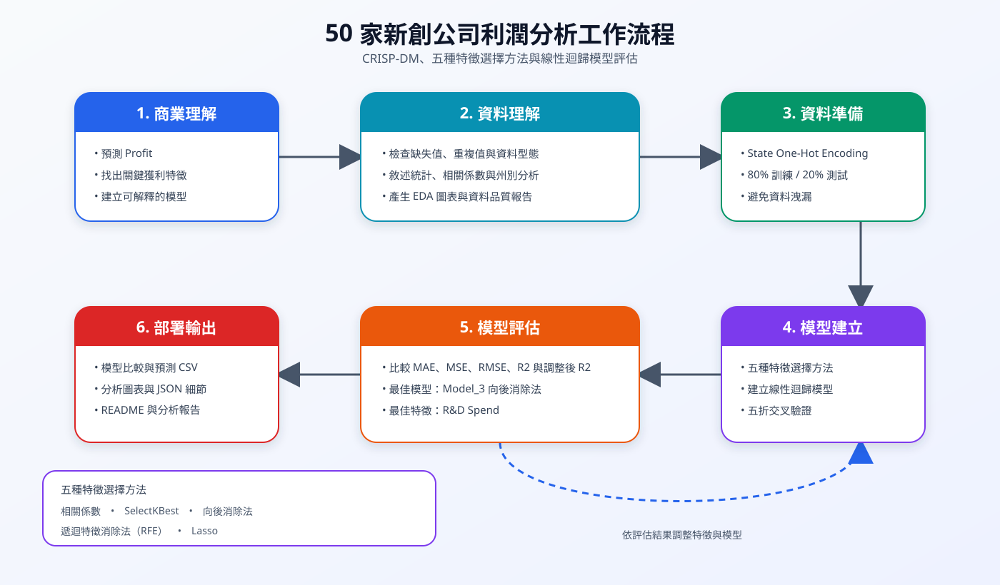
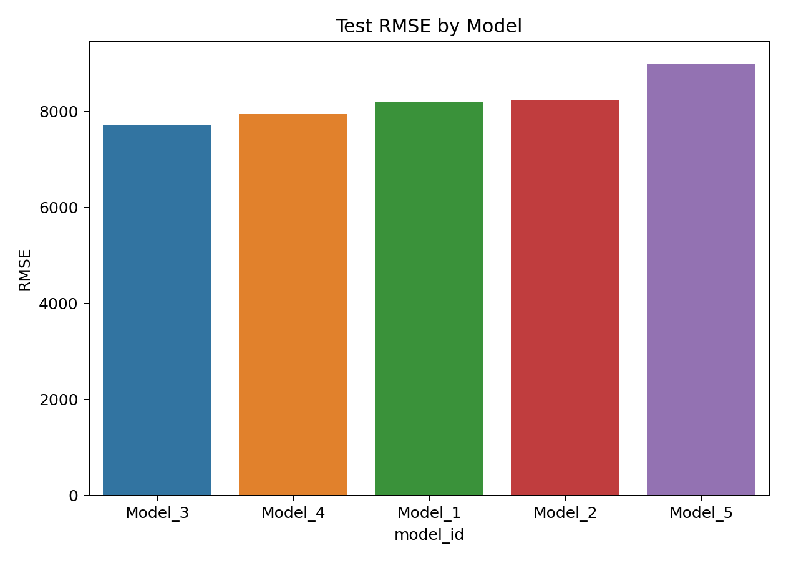
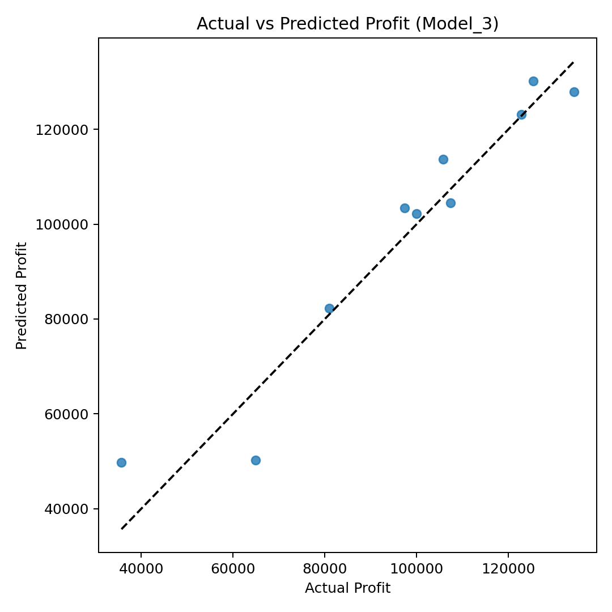
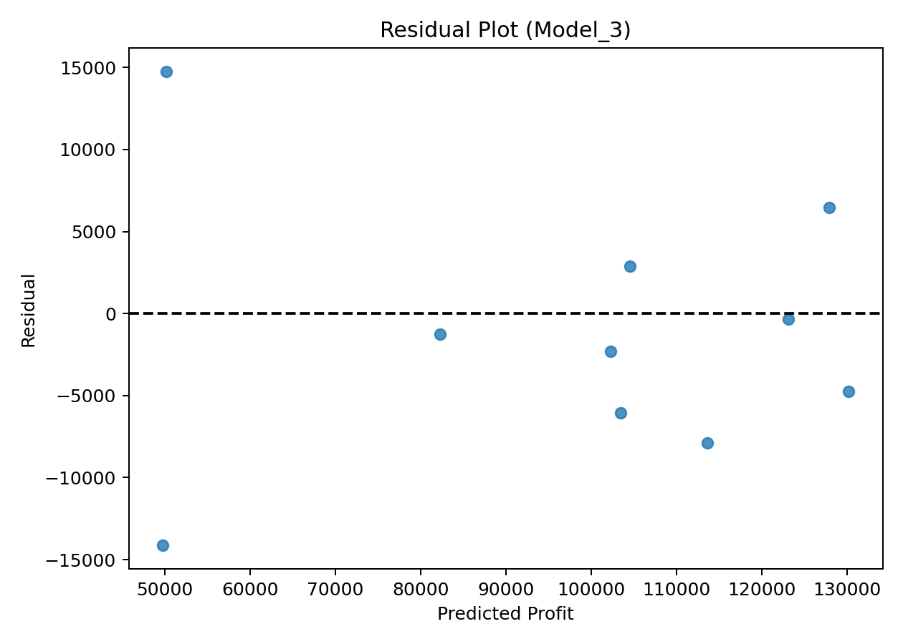
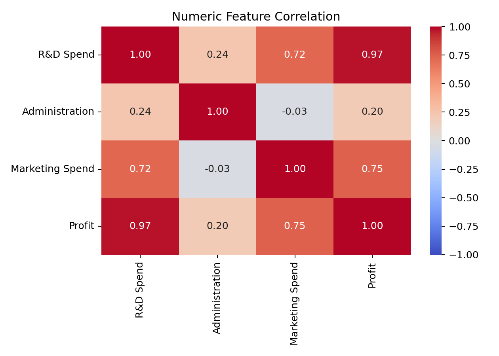
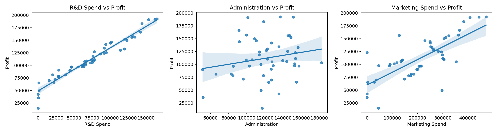
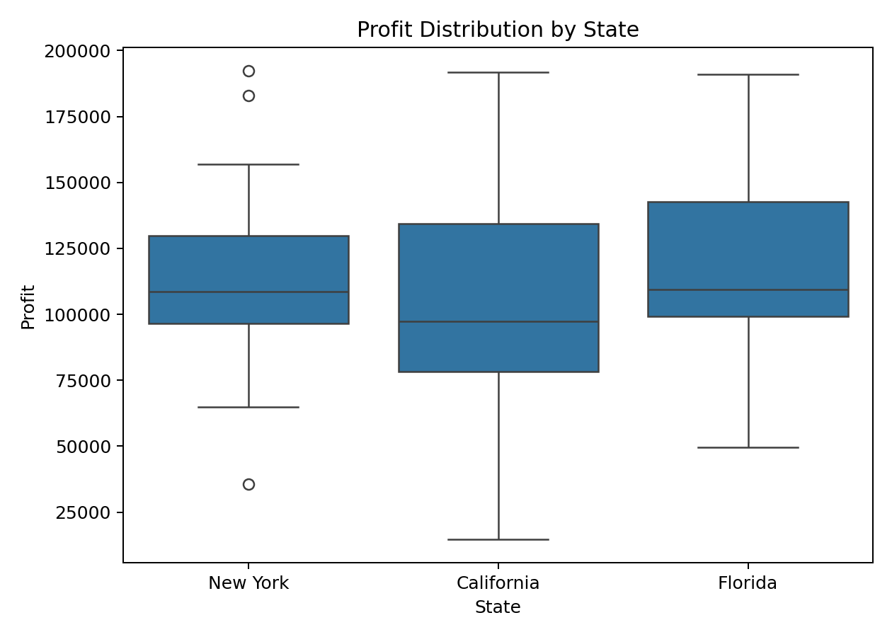

# 50 家新創公司利潤分析

本專案使用 Kaggle 的 `50 Startups` 資料集，依循 **CRISP-DM** 流程，以線性迴歸解釋並預測新創公司的利潤。專案比較五種特徵選擇演算法，評估其預測效能，並產生分析表格、圖表、預測結果與最終報告。

## 專案目標

- 根據新創公司的支出與所在地預測 `Profit`。
- 找出最適合解釋利潤的特徵。
- 在最終預測模型固定使用 `LinearRegression` 的情況下，比較五種特徵選擇方法。
- 產生可重現的探索式資料分析、模型評估與商業解讀。

## 資料集

資料集包含 **50 筆新創公司紀錄**與五個欄位：

| 欄位 | 類型 | 用途 |
|---|---|---|
| `R&D Spend` | 數值 | 特徵 |
| `Administration` | 數值 | 特徵 |
| `Marketing Spend` | 數值 | 特徵 |
| `State` | 類別 | 特徵 |
| `Profit` | 數值 | 預測目標 |

資料品質檢查結果顯示，資料集中**沒有缺失值**，也**沒有重複資料**。各州資料筆數分別為：New York 17 筆、California 17 筆，以及 Florida 16 筆。

各州平均利潤如下：

| 州別 | 平均 Profit |
|---|---:|
| Florida | 118,774.02 |
| New York | 113,756.45 |
| California | 103,905.18 |

各州平均利潤雖有差異，但此結果不代表州別會直接造成利潤差異，仍需透過模型、更多資料及混淆因素控制進一步驗證。

## 分析流程



1. **商業理解：** 將利潤預測與特徵重要性定義為主要商業問題。
2. **資料理解：** 檢查資料品質、敘述性統計、相關係數、數值特徵關係，以及各州的利潤分布。
3. **資料準備：** 對 `State` 進行 One-Hot Encoding 並捨棄第一個類別，再使用 `random_state=42` 將資料分成 80% 訓練集與 20% 測試集。
4. **模型建立：** 使用五種演算法選擇特徵，並針對每組選定的特徵建立線性迴歸模型。
5. **模型評估：** 比較測試集 MAE、MSE、RMSE、R2、調整後 R2，以及經過隨機排序的五折交叉驗證分數。
6. **部署輸出：** 儲存分析表格、預測結果、圖表、特徵選擇細節與分析報告。

特徵選擇僅使用訓練資料進行，以避免資料洩漏。Lasso 特徵選擇會先標準化訓練特徵，而最終線性迴歸模型則使用原始尺度的選定特徵。

## 特徵選擇演算法

| 模型 | 演算法 | 選擇規則 |
|---|---|---|
| Model_1 | 相關係數特徵選擇 | 訓練集絕對相關係數 >= 0.5 |
| Model_2 | SelectKBest 搭配 `f_regression` | 選擇分數最高的三個特徵 |
| Model_3 | 向後消除法 | 移除最高 p-value 的特徵，直到所有 p-value <= 0.05 |
| Model_4 | 遞迴特徵消除法（RFE） | 使用線性迴歸選擇三個特徵 |
| Model_5 | Lasso 特徵選擇 | 保留 `LassoCV` 係數不為零的特徵 |

## 模型結果

| 排名 | 模型 | 選定特徵 | 測試集 MAE | 測試集 RMSE | 測試集 R2 | 調整後 R2 | 交叉驗證 RMSE |
|---:|---|---|---:|---:|---:|---:|---:|
| 1 | Model_3：向後消除法 | R&D Spend | 6,077.36 | **7,714.33** | **0.9265** | **0.9173** | 9,406.58 |
| 2 | Model_4：遞迴特徵消除法 | R&D Spend、State_Florida、State_New York | 6,296.78 | 7,946.37 | 0.9220 | 0.8830 | 10,007.91 |
| 3 | Model_1：相關係數特徵選擇 | R&D Spend、Marketing Spend | 6,469.18 | 8,206.33 | 0.9168 | 0.8931 | 9,186.68 |
| 4 | Model_2：SelectKBest | R&D Spend、Marketing Spend、State_New York | 6,430.58 | 8,242.78 | 0.9161 | 0.8741 | 9,460.92 |
| 5 | Model_5：Lasso | R&D Spend、Administration、Marketing Spend | 6,979.15 | 8,995.91 | 0.9001 | 0.8501 | 9,104.68 |

模型選擇以測試集 **RMSE** 與 **MAE** 為主要依據，並以調整後 R2 與五折交叉驗證結果作為次要參考。較低的 RMSE 與 MAE 代表預測誤差較小；較高的 R2 與調整後 R2 則代表模型能解釋較多利潤變異。

測試集表現最佳的是由向後消除法選出的 **Model_3**：

```text
預測利潤 = 49,336.67 + 0.8536 * R&D Spend
```

此模型具有最低的測試集 RMSE 與 MAE，同時具有最高的測試集 R2 與調整後 R2。在本次資料切分中，研發支出每增加一個單位，預測利潤約增加 `0.85` 個單位。







## 主要發現

- `R&D Spend` 與利潤的 Pearson 相關係數最高，達到 **0.9729**。
- `Marketing Spend` 與利潤具有中度至高度相關，相關係數為 **0.7478**。
- `Administration` 與利潤僅有弱相關，相關係數為 **0.2007**。
- 所有模型都選擇了研發支出，而最佳測試模型僅使用研發支出便能取得良好表現。
- `Marketing Spend` 與 `R&D Spend` 之間也具有較高相關性，因此加入多變量模型後，行銷支出的額外預測貢獻可能下降。
- Florida 的平均利潤最高，但由於本資料集規模小且屬於觀察資料，不應將州別差異解讀為因果關係。
- 增加特徵並未改善測試集表現，顯示簡單且容易解釋的模型具有良好價值。







## 商業解讀

- **研發支出：** 與利潤呈高度正相關，且被所有特徵選擇方法選中，是本資料集中最穩定的重要預測因子。
- **行銷支出：** 與利潤具有中高度相關，但在控制研發支出後，額外貢獻可能有限。
- **行政支出：** 與利潤的單變量相關性較低，對目前模型的預測幫助有限。
- **公司所在地：** 部分模型選擇了州別特徵，但不能據此推論所在地會造成利潤差異。

結果適合作為教學、探索式分析及初步預算討論的參考。由於樣本數有限，不宜直接用於高風險投資或重大資源配置決策。

## 部署建議

若要將模型用於實際預測流程，建議：

1. 蒐集更多不同產業、規模及時間區間的新創公司資料。
2. 驗證輸入資料是否落在訓練資料的合理範圍內。
3. 使用重複交叉驗證或不同隨機切分檢查模型穩定性。
4. 定期監控預測誤差並重新訓練模型。
5. 對重要商業決策保留人工審查。

## 執行分析

執行環境需要 Python 3，以及列於 `requirements.txt` 的套件。

```powershell
python -m pip install -r requirements.txt
python analyze_50_startups.py
```

執行程式後，會重新產生 `outputs/` 目錄中的檔案，並重新寫入 `50_startups_analysis_report.md`。

## 專案檔案

| 路徑 | 說明 |
|---|---|
| `analyze_50_startups.py` | 完整執行探索式資料分析、特徵選擇、模型建立、評估與報告產生 |
| `50_Startups.csv` | 原始資料集 |
| `50_startups_crispdm_linear_regression_design.yaml` | CRISP-DM 與實驗設計規格 |
| `50_startups_analysis_report.md` | 自動產生的原始分析報告；內容已整合至本 README |
| `outputs/model_comparison.csv` | 模型排名、評估指標與選定特徵 |
| `outputs/model_coefficients.csv` | 模型截距與特徵係數 |
| `outputs/test_predictions.csv` | 測試集實際利潤與預測利潤 |
| `outputs/feature_selection_details.json` | 各種特徵選擇方法的詳細結果 |
| `outputs/data_quality.csv` | 缺失值、唯一值與重複資料檢查 |
| `outputs/descriptive_statistics.csv` | 資料集敘述性統計 |
| `outputs/correlation_matrix.csv` | 數值欄位相關係數矩陣 |
| `outputs/state_profit_summary.csv` | 依州別分組的利潤摘要 |
| `outputs/figures/crisp_dm_workflow.svg` | CRISP-DM 分析工作流程圖 |
| `outputs/figures/` | 探索式資料分析與模型效能圖表 |

## 分析限制

資料集僅有 50 筆觀察資料，測試集也只有 10 筆資料，因此評估指標可能會隨資料切分方式而大幅改變。本分析呈現的是特徵與利潤之間的關聯，而非因果效果。若要將模型用於正式環境，仍需要更多資料、重複驗證、模型監控，以及商業領域專家的審查。
