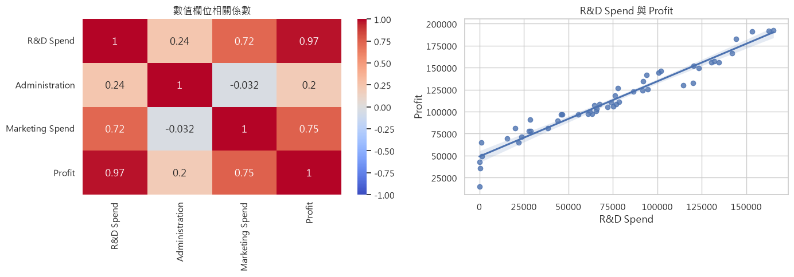
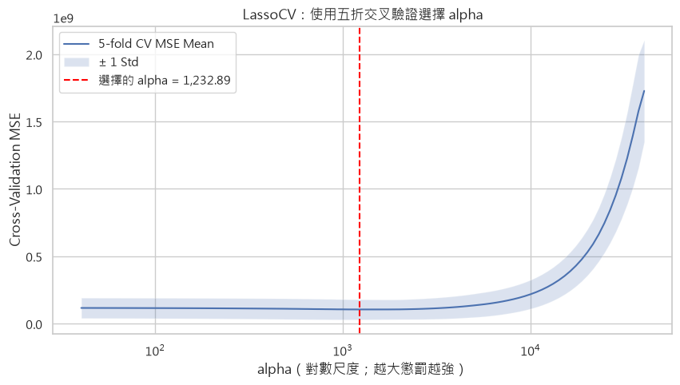
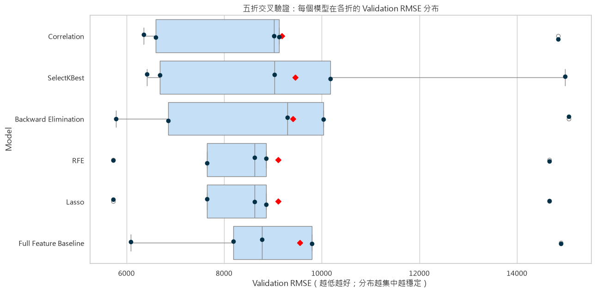
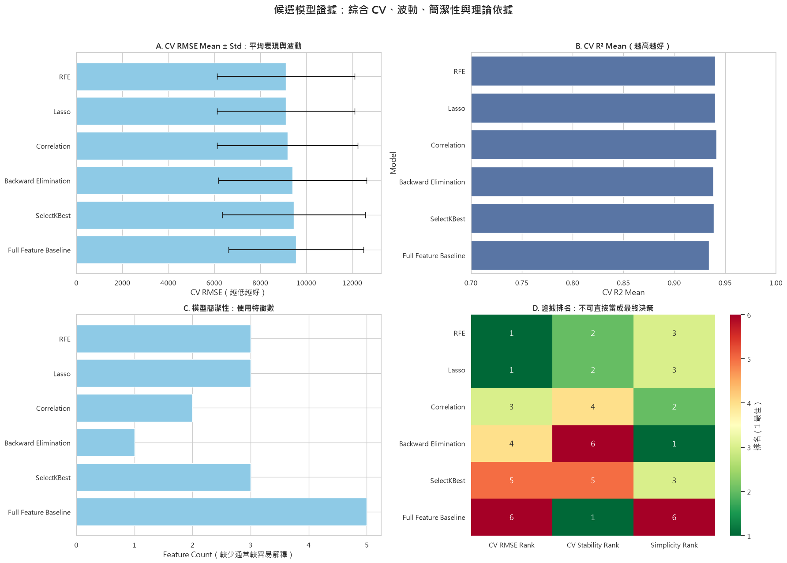
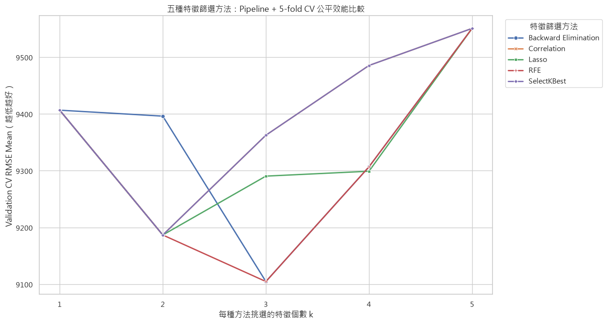
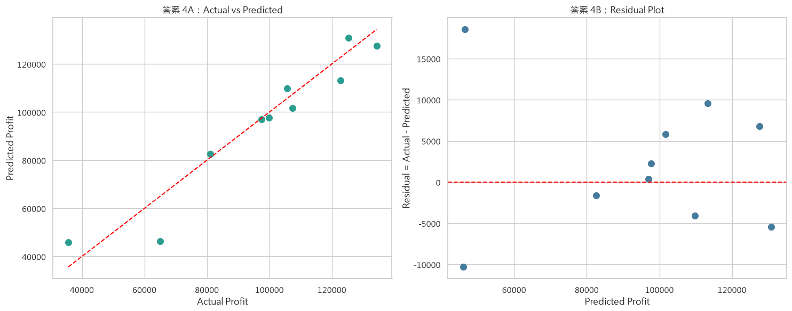

# Kaggle 50 Startups Dataset：CRISP-DM 學習總整理

本 Notebook 將 `learning.txt` 的原有學習問題重新整理成可以逐格執行的教材，並將較複雜的模型比較與評估內容拆分為 **25 個循序學習問題**。

## 學習目標

- 使用 CRISP-DM 六階段完成一個回歸專案
- 正確區分特徵 `X` 與目標 `y`
- 避免 Data Leakage
- 實作五種特徵篩選方法
- 建立、比較、解讀 Linear Regression 模型
- 建立簡易 Profit 預測函式

> 建議依序執行所有儲存格，並閱讀每題下方的解讀。

    圖表中文字型：Microsoft JhengHei
    

# 前置觀念：為什麼這是回歸問題？

`Profit` 是連續數值，例如 `192261.83`，模型要預測的是一個金額，而不是「高／中／低」類別，因此這是 **Regression（回歸）** 問題。

若目標改成「是否獲利」，才會是 Classification（分類）問題。

# 學習問題 1：想預測什麼？商業目標是什麼？

- **預測目標：** 新創公司的 `Profit`
- **商業目的：** 根據研發、行政、行銷投入與州別，估計可能獲利
- **應用：** 預算規劃、投資評估、資源配置

模型只能呈現資料中的關聯，不能直接證明因果關係。

    資料筆數：50
    

<table border="1" class="dataframe">
  <thead>
    <tr style="text-align: right;">
      <th></th>
      <th>R&amp;D Spend</th>
      <th>Administration</th>
      <th>Marketing Spend</th>
      <th>State</th>
      <th>Profit</th>
    </tr>
  </thead>
  <tbody>
    <tr>
      <th>0</th>
      <td>165,349.2000</td>
      <td>136,897.8000</td>
      <td>471,784.1000</td>
      <td>New York</td>
      <td>192,261.8300</td>
    </tr>
    <tr>
      <th>1</th>
      <td>162,597.7000</td>
      <td>151,377.5900</td>
      <td>443,898.5300</td>
      <td>California</td>
      <td>191,792.0600</td>
    </tr>
    <tr>
      <th>2</th>
      <td>153,441.5100</td>
      <td>101,145.5500</td>
      <td>407,934.5400</td>
      <td>Florida</td>
      <td>191,050.3900</td>
    </tr>
    <tr>
      <th>3</th>
      <td>144,372.4100</td>
      <td>118,671.8500</td>
      <td>383,199.6200</td>
      <td>New York</td>
      <td>182,901.9900</td>
    </tr>
    <tr>
      <th>4</th>
      <td>142,107.3400</td>
      <td>91,391.7700</td>
      <td>366,168.4200</td>
      <td>Florida</td>
      <td>166,187.9400</td>
    </tr>
  </tbody>
</table>

# 學習問題 2：哪些是特徵 X？哪一個是目標 y？

- `X`：R&D Spend、Administration、Marketing Spend、State
- `y`：Profit

    X 欄位： ['R&D Spend', 'Administration', 'Marketing Spend', 'State']
    y 名稱： Profit
    X shape: (50, 4) | y shape: (50,)
    

# 學習問題 3：數值型與類別型特徵有什麼差異？

Linear Regression 需要數值輸入。`State` 是無大小順序的類別，不能直接編成 1、2、3，否則模型會誤以為州別有數值距離與順序。

正確做法是 **One-Hot Encoding**。`drop="first"` 會保留一個參考類別，避免 dummy variable trap。

<table border="1" class="dataframe">
  <thead>
    <tr style="text-align: right;">
      <th></th>
      <th>R&amp;D Spend</th>
      <th>Administration</th>
      <th>Marketing Spend</th>
      <th>State_Florida</th>
      <th>State_New York</th>
    </tr>
  </thead>
  <tbody>
    <tr>
      <th>0</th>
      <td>165,349.2000</td>
      <td>136,897.8000</td>
      <td>471,784.1000</td>
      <td>0</td>
      <td>1</td>
    </tr>
    <tr>
      <th>1</th>
      <td>162,597.7000</td>
      <td>151,377.5900</td>
      <td>443,898.5300</td>
      <td>0</td>
      <td>0</td>
    </tr>
    <tr>
      <th>2</th>
      <td>153,441.5100</td>
      <td>101,145.5500</td>
      <td>407,934.5400</td>
      <td>1</td>
      <td>0</td>
    </tr>
    <tr>
      <th>3</th>
      <td>144,372.4100</td>
      <td>118,671.8500</td>
      <td>383,199.6200</td>
      <td>0</td>
      <td>1</td>
    </tr>
    <tr>
      <th>4</th>
      <td>142,107.3400</td>
      <td>91,391.7700</td>
      <td>366,168.4200</td>
      <td>1</td>
      <td>0</td>
    </tr>
  </tbody>
</table>

# 學習問題 4：建模前為什麼要觀察資料？

需要確認欄位型態、缺失值、重複值、分布、離群值，以及特徵和目標的初步關係。若資料品質有問題，模型結果也會失真。

<table border="1" class="dataframe">
  <thead>
    <tr style="text-align: right;">
      <th></th>
      <th>dtype</th>
      <th>missing</th>
      <th>unique</th>
    </tr>
  </thead>
  <tbody>
    <tr>
      <th>R&amp;D Spend</th>
      <td>float64</td>
      <td>0</td>
      <td>49</td>
    </tr>
    <tr>
      <th>Administration</th>
      <td>float64</td>
      <td>0</td>
      <td>50</td>
    </tr>
    <tr>
      <th>Marketing Spend</th>
      <td>float64</td>
      <td>0</td>
      <td>48</td>
    </tr>
    <tr>
      <th>State</th>
      <td>object</td>
      <td>0</td>
      <td>3</td>
    </tr>
    <tr>
      <th>Profit</th>
      <td>float64</td>
      <td>0</td>
      <td>50</td>
    </tr>
  </tbody>
</table>

    重複資料筆數： 0
    

<table border="1" class="dataframe">
  <thead>
    <tr style="text-align: right;">
      <th></th>
      <th>count</th>
      <th>unique</th>
      <th>top</th>
      <th>freq</th>
      <th>mean</th>
      <th>std</th>
      <th>min</th>
      <th>25%</th>
      <th>50%</th>
      <th>75%</th>
      <th>max</th>
    </tr>
  </thead>
  <tbody>
    <tr>
      <th>R&amp;D Spend</th>
      <td>50.0000</td>
      <td>NaN</td>
      <td>NaN</td>
      <td>NaN</td>
      <td>73,721.6156</td>
      <td>45,902.2565</td>
      <td>0.0000</td>
      <td>39,936.3700</td>
      <td>73,051.0800</td>
      <td>101,602.8000</td>
      <td>165,349.2000</td>
    </tr>
    <tr>
      <th>Administration</th>
      <td>50.0000</td>
      <td>NaN</td>
      <td>NaN</td>
      <td>NaN</td>
      <td>121,344.6396</td>
      <td>28,017.8028</td>
      <td>51,283.1400</td>
      <td>103,730.8750</td>
      <td>122,699.7950</td>
      <td>144,842.1800</td>
      <td>182,645.5600</td>
    </tr>
    <tr>
      <th>Marketing Spend</th>
      <td>50.0000</td>
      <td>NaN</td>
      <td>NaN</td>
      <td>NaN</td>
      <td>211,025.0978</td>
      <td>122,290.3107</td>
      <td>0.0000</td>
      <td>129,300.1325</td>
      <td>212,716.2400</td>
      <td>299,469.0850</td>
      <td>471,784.1000</td>
    </tr>
    <tr>
      <th>State</th>
      <td>50</td>
      <td>3</td>
      <td>New York</td>
      <td>17</td>
      <td>NaN</td>
      <td>NaN</td>
      <td>NaN</td>
      <td>NaN</td>
      <td>NaN</td>
      <td>NaN</td>
      <td>NaN</td>
    </tr>
    <tr>
      <th>Profit</th>
      <td>50.0000</td>
      <td>NaN</td>
      <td>NaN</td>
      <td>NaN</td>
      <td>112,012.6392</td>
      <td>40,306.1803</td>
      <td>14,681.4000</td>
      <td>90,138.9025</td>
      <td>107,978.1900</td>
      <td>139,765.9775</td>
      <td>192,261.8300</td>
    </tr>
  </tbody>
</table>

# 學習問題 5：初步觀察結果與可能重要的特徵

<table border="1" class="dataframe">
  <thead>
    <tr style="text-align: right;">
      <th></th>
      <th>Profit</th>
    </tr>
  </thead>
  <tbody>
    <tr>
      <th>Profit</th>
      <td>1.0000</td>
    </tr>
    <tr>
      <th>R&amp;D Spend</th>
      <td>0.9729</td>
    </tr>
    <tr>
      <th>Marketing Spend</th>
      <td>0.7478</td>
    </tr>
    <tr>
      <th>Administration</th>
      <td>0.2007</td>
    </tr>
  </tbody>
</table>

    

    

<table border="1" class="dataframe">
  <thead>
    <tr style="text-align: right;">
      <th></th>
      <th>count</th>
      <th>mean</th>
      <th>median</th>
      <th>std</th>
    </tr>
    <tr>
      <th>State</th>
      <th></th>
      <th></th>
      <th></th>
      <th></th>
    </tr>
  </thead>
  <tbody>
    <tr>
      <th>California</th>
      <td>17</td>
      <td>103,905.1753</td>
      <td>97,427.8400</td>
      <td>44,446.3594</td>
    </tr>
    <tr>
      <th>Florida</th>
      <td>16</td>
      <td>118,774.0244</td>
      <td>109,543.1200</td>
      <td>35,605.4704</td>
    </tr>
    <tr>
      <th>New York</th>
      <td>17</td>
      <td>113,756.4465</td>
      <td>108,552.0400</td>
      <td>41,140.2581</td>
    </tr>
  </tbody>
</table>

**結果解讀：**

- `R&D Spend` 與 `Profit` 的線性關係最強
- `Marketing Spend` 有中度正相關
- `Administration` 的單變量線性關係較弱
- 州別平均獲利不同，但樣本很少，不能直接斷言州別造成獲利差異

# 學習問題 6：為什麼要切分訓練集與測試集？

- Training Set：讓模型學習
- Testing Set：模擬模型面對未見資料的表現

若用同一批資料訓練又評估，分數通常會過度樂觀。

    Train: (40, 4) (40,)
    Test : (10, 4) (10,)
    

# 學習問題 7：什麼是 Data Leakage？

Data Leakage 是模型訓練時偷看到測試資料資訊。例如先用全部資料做特徵篩選，再切分 Train/Test。

**正確流程：** 先切分資料，再只使用 Training Set 擬合編碼器、標準化器與特徵篩選器。

# 學習問題 8：完整的標準資料準備流程

Data Preparation 不只是 One-Hot Encoding。完整流程必須把原始資料轉換成「模型可以安全學習、測試與部署」的格式。

## 完整流程總覽

1. **確認問題與資料契約**
   - 確認目標欄位是 `Profit`
   - 確認必要輸入欄位、資料型態與合理範圍
   - 避免把目標或目標衍生欄位放入特徵
2. **進行資料品質檢查**
   - 檢查缺失值、重複值、錯誤型態、非法類別與異常值
   - 決定清理規則，但不可因看到測試結果而修改規則
3. **區分特徵 X 與目標 y**
   - `X` 只包含預測時可以取得的資料
   - `y` 是模型需要預測的 `Profit`
4. **先切分 Training Set 與 Testing Set**
   - 所有會從資料學習參數的轉換，都只能在 Training Set 上 `fit`
   - Testing Set 只能使用已學好的轉換器 `transform`
5. **處理缺失值**
   - 數值欄位可使用 Training Set 的中位數填補
   - 類別欄位可使用 Training Set 的眾數填補
   - 本資料目前沒有缺失值，但正式流程仍應準備處理策略
6. **處理類別特徵**
   - `State` 使用 One-Hot Encoding
   - `handle_unknown="ignore"` 可處理測試或部署時出現未見類別
7. **判斷是否需要數值縮放**
   - 一般 Linear Regression 不一定需要縮放
   - Lasso、Ridge、距離模型等對尺度敏感，通常需要 StandardScaler
8. **確認 Train/Test 欄位完全一致**
   - 欄位名稱、順序與數量必須相同
9. **特徵篩選只能使用 Training Set**
   - 測試集不能參與相關係數、p-value、SelectKBest、RFE 或 Lasso 篩選
10. **使用 Pipeline 保存完整轉換流程**
    - 訓練、測試與部署都使用相同處理步驟
    - 降低資料外洩與人工處理錯誤

## 步驟 1：驗證資料契約與品質

這一步先確認必要欄位存在、資料型態正確，以及目標欄位沒有缺失。  
若發現缺失值或異常值，應先定義處理原則；不要看到測試分數後才決定如何清理。

<table border="1" class="dataframe">
  <thead>
    <tr style="text-align: right;">
      <th></th>
      <th>dtype</th>
      <th>missing_count</th>
      <th>unique_count</th>
    </tr>
  </thead>
  <tbody>
    <tr>
      <th>R&amp;D Spend</th>
      <td>float64</td>
      <td>0</td>
      <td>49</td>
    </tr>
    <tr>
      <th>Administration</th>
      <td>float64</td>
      <td>0</td>
      <td>50</td>
    </tr>
    <tr>
      <th>Marketing Spend</th>
      <td>float64</td>
      <td>0</td>
      <td>48</td>
    </tr>
    <tr>
      <th>State</th>
      <td>object</td>
      <td>0</td>
      <td>3</td>
    </tr>
    <tr>
      <th>Profit</th>
      <td>float64</td>
      <td>0</td>
      <td>50</td>
    </tr>
  </tbody>
</table>

    重複資料筆數： 0
    State 合法類別： ['California', 'Florida', 'New York']
    

## 步驟 2：先切分，再學習資料轉換參數

前面已完成 `X_train_raw`、`X_test_raw`、`y_train`、`y_test` 的切分。  
以下所有 `fit` 操作都只能使用 `X_train_raw` 或 `y_train`：

- 缺失值填補值
- One-Hot Encoder 類別集合
- StandardScaler 平均值與標準差
- 特徵篩選規則

測試資料只能呼叫 `transform`，不能重新 `fit`。

## 步驟 3：缺失值策略

這份資料目前沒有缺失值，因此下方手動流程可以直接編碼。正式專案仍建議預先定義：

| 欄位類型 | 建議策略 | 為什麼只用 Training Set？ |
|---|---|---|
| 數值欄位 | 中位數 `median` | 避免測試集分布資訊洩漏 |
| 類別欄位 | 眾數 `most_frequent` | 避免偷看測試集最常見類別 |
| 目標 Profit | 通常刪除該筆或回查來源 | 目標不可任意填補後拿來訓練 |

如果缺失值本身具有商業意義，也可以增加「是否缺失」指標欄位。

## 步驟 4：手動展示 One-Hot Encoding

為了讓後續五種特徵篩選方法可以直接操作欄位名稱，這裡先手動建立 DataFrame。  
關鍵是 Encoder 只在 Training Set 使用 `fit_transform`，Testing Set 只能使用 `transform`。

    編碼後特徵： ['R&D Spend', 'Administration', 'Marketing Spend', 'State_Florida', 'State_New York']
    

<table border="1" class="dataframe">
  <thead>
    <tr style="text-align: right;">
      <th></th>
      <th>R&amp;D Spend</th>
      <th>Administration</th>
      <th>Marketing Spend</th>
      <th>State_Florida</th>
      <th>State_New York</th>
    </tr>
  </thead>
  <tbody>
    <tr>
      <th>0</th>
      <td>93,863.7500</td>
      <td>127,320.3800</td>
      <td>249,839.4400</td>
      <td>1.0000</td>
      <td>0.0000</td>
    </tr>
    <tr>
      <th>1</th>
      <td>142,107.3400</td>
      <td>91,391.7700</td>
      <td>366,168.4200</td>
      <td>1.0000</td>
      <td>0.0000</td>
    </tr>
    <tr>
      <th>2</th>
      <td>44,069.9500</td>
      <td>51,283.1400</td>
      <td>197,029.4200</td>
      <td>0.0000</td>
      <td>0.0000</td>
    </tr>
    <tr>
      <th>3</th>
      <td>120,542.5200</td>
      <td>148,718.9500</td>
      <td>311,613.2900</td>
      <td>0.0000</td>
      <td>1.0000</td>
    </tr>
    <tr>
      <th>4</th>
      <td>144,372.4100</td>
      <td>118,671.8500</td>
      <td>383,199.6200</td>
      <td>0.0000</td>
      <td>1.0000</td>
    </tr>
  </tbody>
</table>

    X_train shape: (40, 5)
    X_test shape : (10, 5)
    Train/Test 欄位一致： True
    

<table border="1" class="dataframe">
  <thead>
    <tr style="text-align: right;">
      <th></th>
      <th>資料集</th>
      <th>資料筆數</th>
    </tr>
  </thead>
  <tbody>
    <tr>
      <th>0</th>
      <td>X_train</td>
      <td>40</td>
    </tr>
    <tr>
      <th>1</th>
      <td>X_test</td>
      <td>10</td>
    </tr>
    <tr>
      <th>2</th>
      <td>y_train</td>
      <td>40</td>
    </tr>
    <tr>
      <th>3</th>
      <td>y_test</td>
      <td>10</td>
    </tr>
  </tbody>
</table>

## 步驟 5：何時需要 StandardScaler？

- **一般 Linear Regression：** 不縮放仍可得到相同預測能力，原始單位係數也較容易解釋。
- **Lasso-based Selection：** 必須先縮放，否則金額範圍較大的欄位會受到不公平影響。
- **重要原則：** Scaler 只能在 Training Set `fit`，再對 Test Set `transform`。

本 Notebook 會保留未縮放的 `X_train`、`X_test` 建立一般 Linear Regression；到 Lasso 學習問題時才另外使用 StandardScaler。

## 步驟 6：正式專案建議使用 Pipeline

手動流程適合學習每一步；正式訓練與部署則建議使用 `ColumnTransformer + Pipeline`：

- 數值欄位：中位數填補
- 類別欄位：眾數填補後 One-Hot Encoding
- 模型：Linear Regression

Pipeline 在 `.fit()` 時只從 Training Set 學習所有參數，`.predict()` 時會自動套用完全相同的轉換。

    Pipeline 轉換後特徵： ['R&D Spend', 'Administration', 'Marketing Spend', 'State_Florida', 'State_New York']
    Pipeline 已只使用 Training Set 完成擬合；外部 Test Set 保留到最後評估。
    

## 資料準備完成後的檢查清單

- [x] 目標 `Profit` 沒有出現在特徵中
- [x] 先切分 Train/Test，才擬合資料轉換器
- [x] 缺失值處理策略已定義
- [x] `State` 已安全完成 One-Hot Encoding
- [x] 未知州別可由 `handle_unknown="ignore"` 處理
- [x] Train/Test 轉換後欄位名稱與順序一致
- [x] 特徵篩選將只使用 Training Set
- [x] 正式部署可使用 Pipeline 重現相同轉換

完成這些檢查後，才進入下一階段的特徵篩選與建模。

# 學習問題 9：什麼是特徵篩選？

特徵篩選會保留較有用的欄位，可能帶來：

- 更簡潔且容易解釋的模型
- 減少雜訊與過度配適風險
- 降低不必要的資料蒐集成本

但特徵越少不一定越好，必須用測試集與交叉驗證比較。

# 學習問題 10：相關係數法

<table border="1" class="dataframe">
  <thead>
    <tr style="text-align: right;">
      <th></th>
      <th>與 Profit 的相關係數</th>
    </tr>
  </thead>
  <tbody>
    <tr>
      <th>R&amp;D Spend</th>
      <td>0.9730</td>
    </tr>
    <tr>
      <th>Marketing Spend</th>
      <td>0.7738</td>
    </tr>
    <tr>
      <th>State_New York</th>
      <td>0.1050</td>
    </tr>
    <tr>
      <th>State_Florida</th>
      <td>0.0955</td>
    </tr>
    <tr>
      <th>Administration</th>
      <td>0.0902</td>
    </tr>
  </tbody>
</table>

    選取特徵： ['R&D Spend', 'Marketing Spend']
    

相關係數法快速且容易解釋，但只看每個特徵和目標的單獨線性關係，沒有考慮特徵彼此的互動與共線性。

# 學習問題 11：SelectKBest / f_regression

## 方法核心概念

`SelectKBest` 是一種 **Filter Method（過濾式特徵篩選）**。它不先建立完整的最終模型，而是分別計算每個特徵與目標 `Profit` 的統計關係，再選出分數最高的前 `K` 個特徵。

這裡使用的評分函式是 `f_regression`。對每個特徵，它會執行一個單變量線性迴歸檢定：

- **虛無假設 H₀：** 此特徵與 `Profit` 沒有線性關係，斜率為 0。
- **對立假設 H₁：** 此特徵與 `Profit` 存在線性關係，斜率不為 0。

## F-score 與 p-value 如何判讀？

- **F-score 越大：** 該特徵單獨解釋 `Profit` 的線性能力越強。
- **p-value 越小：** 若實際沒有線性關係，卻觀察到目前 F-score 的機率越低。
- `SelectKBest` 實際依照 **F-score 排名**，不會自動使用 p-value 門檻。

對單一特徵而言，F-score 和 Pearson 相關係數高度相關，因此結果可能與相關係數法相近。但兩者的選取規則不同：

| 方法 | 選取規則 |
|---|---|
| Correlation Threshold | 保留絕對相關係數超過門檻的特徵，特徵數不固定 |
| SelectKBest | 固定選擇 F-score 最高的前 K 個特徵 |

## 執行流程

1. 只使用 Training Set。
2. 分別計算每個特徵對 `Profit` 的 F-score。
3. 將特徵依 F-score 由大到小排序。
4. 保留前 `K` 個特徵。

本例設定 `k=3`，代表無論第三名分數高低，都會選取三個特徵。

<table border="1" class="dataframe">
  <thead>
    <tr style="text-align: right;">
      <th></th>
      <th>feature</th>
      <th>F score</th>
      <th>p-value</th>
      <th>selected</th>
    </tr>
  </thead>
  <tbody>
    <tr>
      <th>0</th>
      <td>R&amp;D Spend</td>
      <td>676.1035</td>
      <td>0.0000</td>
      <td>True</td>
    </tr>
    <tr>
      <th>2</th>
      <td>Marketing Spend</td>
      <td>56.6907</td>
      <td>0.0000</td>
      <td>True</td>
    </tr>
    <tr>
      <th>4</th>
      <td>State_New York</td>
      <td>0.4238</td>
      <td>0.5189</td>
      <td>True</td>
    </tr>
    <tr>
      <th>3</th>
      <td>State_Florida</td>
      <td>0.3497</td>
      <td>0.5578</td>
      <td>False</td>
    </tr>
    <tr>
      <th>1</th>
      <td>Administration</td>
      <td>0.3120</td>
      <td>0.5798</td>
      <td>False</td>
    </tr>
  </tbody>
</table>

    選取特徵： ['R&D Spend', 'Marketing Spend', 'State_New York']
    

## 如何解讀本資料集結果？

請先查看上表的 `F score`、`p-value` 與 `selected`：

- `selected=True` 表示該特徵位於前三名。
- 第一名通常是 `R&D Spend`，表示它單獨與 `Profit` 的線性關係最強。
- One-Hot Encoding 後的州別欄位，也會被當成獨立特徵分別評分。

## 優點

- 計算快速，適合特徵很多的資料。
- 結果容易排序與解釋。
- 不依賴最終模型，因此可先快速縮小特徵範圍。

## 限制與注意事項

- 每個特徵都是單獨評分，**不考慮特徵彼此的交互作用與共線性**。
- `k` 必須事先指定；若要調整 K，應在 Training Set 內使用交叉驗證。
- F-test 假設關係主要是線性的，非線性但重要的特徵可能被低估。
- 必須先切分 Train/Test，再於 Training Set 執行 `fit`，否則會造成資料外洩。

# 學習問題 12：Backward Elimination

## 方法核心概念

Backward Elimination 是一種 **Wrapper / Statistical Method**。它從全部候選特徵開始建立多元線性迴歸，然後逐步刪除在「其他特徵已經存在」的條件下，統計上最不顯著的特徵。

它回答的問題不是：

> 這個特徵單獨與 Profit 有沒有關係？

而是：

> 控制模型中其他特徵後，這個特徵是否仍提供額外的線性解釋能力？

## p-value 的假設檢定

對模型中的每個係數，檢定：

- **H₀：** 該特徵係數等於 0；控制其他特徵後，它沒有額外貢獻。
- **H₁：** 該特徵係數不等於 0。

常見門檻為 `0.05`：

- `p-value <= 0.05`：保留，因為有較強證據認為係數不為 0。
- `p-value > 0.05`：可能移除；其中 p-value 最大者優先移除。

## 執行流程

1. 使用所有特徵建立 OLS 模型。
2. 找出 p-value 最大的特徵。
3. 若最大 p-value 大於 `0.05`，移除該特徵。
4. 使用剩餘特徵重新建立模型。
5. 重複執行，直到所有保留特徵的 p-value 都不超過門檻。

每次移除後都必須重新訓練，因為特徵之間可能共享解釋能力。

<table border="1" class="dataframe">
  <thead>
    <tr style="text-align: right;">
      <th></th>
      <th>step</th>
      <th>removed_feature</th>
      <th>p_value_when_removed</th>
      <th>features_before_removal</th>
      <th>adjusted_R2_before_removal</th>
    </tr>
  </thead>
  <tbody>
    <tr>
      <th>0</th>
      <td>1</td>
      <td>State_New York</td>
      <td>0.9986</td>
      <td>R&amp;D Spend, Administration, Marketing Spend, St...</td>
      <td>0.9469</td>
    </tr>
    <tr>
      <th>1</th>
      <td>2</td>
      <td>State_Florida</td>
      <td>0.7755</td>
      <td>R&amp;D Spend, Administration, Marketing Spend, St...</td>
      <td>0.9484</td>
    </tr>
    <tr>
      <th>2</th>
      <td>3</td>
      <td>Administration</td>
      <td>0.2570</td>
      <td>R&amp;D Spend, Administration, Marketing Spend</td>
      <td>0.9497</td>
    </tr>
    <tr>
      <th>3</th>
      <td>4</td>
      <td>Marketing Spend</td>
      <td>0.0552</td>
      <td>R&amp;D Spend, Marketing Spend</td>
      <td>0.9493</td>
    </tr>
  </tbody>
</table>

    選取特徵： ['R&D Spend']
    最終模型 Adjusted R²： 0.9453860654564774
    

<table border="1" class="dataframe">
  <thead>
    <tr style="text-align: right;">
      <th></th>
      <th>Coef.</th>
      <th>Std.Err.</th>
      <th>t</th>
      <th>p-value</th>
      <th>[0.025</th>
      <th>0.975]</th>
    </tr>
  </thead>
  <tbody>
    <tr>
      <th>const</th>
      <td>49,336.6680</td>
      <td>2,985.8187</td>
      <td>16.5237</td>
      <td>0.0000</td>
      <td>43,292.1940</td>
      <td>55,381.1421</td>
    </tr>
    <tr>
      <th>R&amp;D Spend</th>
      <td>0.8536</td>
      <td>0.0328</td>
      <td>26.0020</td>
      <td>0.0000</td>
      <td>0.7872</td>
      <td>0.9201</td>
    </tr>
  </tbody>
</table>

## 如何解讀本資料集結果？

- `backward_history_df` 顯示每一步移除哪個特徵、當時的 p-value，以及移除前模型的 Adjusted R²。
- 最終係數表中的 `p-value` 顯示保留特徵在最終模型中的顯著性。
- 若最後只保留 `R&D Spend`，代表在目前 Training Set 與 `0.05` 門檻下，其他特徵沒有提供足夠明確的額外線性解釋能力。

這不代表被移除特徵在商業上完全不重要，也不代表它們沒有因果效果。

## 優點

- 同時考慮多個特徵，能觀察控制其他變數後的額外貢獻。
- 最終模型通常較簡潔，並有清楚的 p-value 解釋。
- 適合希望進行統計推論與模型解釋的情境。

## 限制與注意事項

- p-value 會受到樣本量、離群值、共線性與線性迴歸假設影響。
- 小型資料集的選取結果可能不穩定；換一次 Train/Test Split 可能得到不同結果。
- 逐步選擇後的 p-value 會有選模偏誤，不應視為完全獨立的正式推論。
- 門檻 `0.05` 是慣例，不是永遠正確的答案。
- 所有步驟只能在 Training Set 執行。

# 學習問題 13：Recursive Feature Elimination（RFE）

## 方法核心概念

RFE 是一種 **Wrapper Method（包裝式方法）**。它使用指定的模型反覆訓練，依模型提供的特徵重要性刪除較弱的特徵，直到剩下指定數量。

搭配 `LinearRegression` 時，RFE 使用迴歸係數絕對值判斷特徵重要性：

- 係數絕對值較大：模型認為影響較強。
- 係數絕對值較小：較早被移除。

## 為什麼 RFE 前需要注意尺度？

`R&D Spend` 等金額特徵的數值可能是數十萬，而州別 dummy 只有 0 或 1。直接比較原始係數大小可能不公平，因此本例先使用 Training Set 的 `StandardScaler` 標準化，再執行 RFE。

最終 Linear Regression 仍可使用原始尺度資料重新訓練，以保留容易解讀的原始單位係數。

## 執行流程

1. 指定基礎模型，例如 `LinearRegression`。
2. 使用全部特徵訓練模型。
3. 根據係數重要性移除最弱特徵。
4. 使用剩餘特徵重新訓練。
5. 重複直到剩下 `n_features_to_select` 個特徵。

本例指定保留 3 個特徵，`step=1` 表示每輪移除 1 個。

<table border="1" class="dataframe">
  <thead>
    <tr style="text-align: right;">
      <th></th>
      <th>feature</th>
      <th>selected</th>
      <th>ranking</th>
      <th>initial_standardized_coefficient</th>
      <th>absolute_initial_coefficient</th>
    </tr>
  </thead>
  <tbody>
    <tr>
      <th>0</th>
      <td>R&amp;D Spend</td>
      <td>True</td>
      <td>1</td>
      <td>38,102.2693</td>
      <td>38,102.2693</td>
    </tr>
    <tr>
      <th>2</th>
      <td>Marketing Spend</td>
      <td>True</td>
      <td>1</td>
      <td>3,386.1758</td>
      <td>3,386.1758</td>
    </tr>
    <tr>
      <th>1</th>
      <td>Administration</td>
      <td>True</td>
      <td>1</td>
      <td>-1,864.7543</td>
      <td>1,864.7543</td>
    </tr>
    <tr>
      <th>3</th>
      <td>State_Florida</td>
      <td>False</td>
      <td>2</td>
      <td>447.7757</td>
      <td>447.7757</td>
    </tr>
    <tr>
      <th>4</th>
      <td>State_New York</td>
      <td>False</td>
      <td>3</td>
      <td>3.2729</td>
      <td>3.2729</td>
    </tr>
  </tbody>
</table>

    選取特徵： ['R&D Spend', 'Administration', 'Marketing Spend']
    

## 如何解讀本資料集結果？

- `selected=True` 或 `ranking=1` 表示最後保留的特徵。
- `ranking=2` 表示最後一輪前被移除；排名數字越大，越早被移除。
- `initial_standardized_coefficient` 是第一輪全部特徵模型的標準化係數，只用來輔助理解；RFE 每輪都會重新訓練，所以最終排名不只由第一輪決定。

## 優點

- 會考慮基礎模型中的多特徵關係。
- 可直接控制希望保留的特徵數量。
- 比單變量 Filter Method 更貼近最終模型行為。

## 限制與注意事項

- 必須事先指定保留幾個特徵。
- 結果依賴基礎模型；換成其他模型可能得到不同特徵。
- 特徵尺度會影響線性模型係數，因此需先標準化後再比較。
- 特徵數很多時，反覆訓練的計算成本較高。
- `n_features_to_select` 應在 Training Set 內透過交叉驗證決定，不能依測試集結果反覆修改。

# 學習問題 14：Lasso-based Selection

## 方法核心概念

Lasso 是一種 **Embedded Method（嵌入式方法）**：在訓練迴歸模型的同時完成特徵篩選。

一般線性迴歸最小化預測平方誤差；Lasso 額外加入 L1 懲罰：

`目標函數 = 預測平方誤差 + alpha × 所有係數絕對值總和`

L1 懲罰會鼓勵模型把部分係數精確壓縮為 0：

- 係數不為 0：保留特徵。
- 係數為 0：移除特徵。

## alpha 控制什麼？

- `alpha` 越小：懲罰較弱，保留較多特徵，接近一般 Linear Regression。
- `alpha` 越大：懲罰較強，更多係數變成 0，模型更簡潔。
- `LassoCV` 使用交叉驗證，在 Training Set 中尋找合適的 alpha。

## 為什麼一定要先標準化？

Lasso 直接懲罰係數大小。若特徵尺度不同，係數大小不可公平比較，因此必須先使用 Training Set 的 `StandardScaler`。

## 執行流程

1. 在 Training Set 擬合 StandardScaler。
2. 將 Training Set 標準化。
3. 使用五折交叉驗證評估多個 alpha。
4. 選擇交叉驗證誤差較低的 alpha。
5. 保留係數不為 0 的特徵。
6. 使用選出的特徵重新建立可解釋的 Linear Regression。

<table border="1" class="dataframe">
  <thead>
    <tr style="text-align: right;">
      <th></th>
      <th>feature</th>
      <th>standardized_coefficient</th>
      <th>absolute_coefficient</th>
      <th>selected</th>
    </tr>
  </thead>
  <tbody>
    <tr>
      <th>R&amp;D Spend</th>
      <td>R&amp;D Spend</td>
      <td>36,546.5638</td>
      <td>36,546.5638</td>
      <td>True</td>
    </tr>
    <tr>
      <th>Marketing Spend</th>
      <td>Marketing Spend</td>
      <td>3,554.8005</td>
      <td>3,554.8005</td>
      <td>True</td>
    </tr>
    <tr>
      <th>Administration</th>
      <td>Administration</td>
      <td>-378.0947</td>
      <td>378.0947</td>
      <td>True</td>
    </tr>
    <tr>
      <th>State_Florida</th>
      <td>State_Florida</td>
      <td>0.0000</td>
      <td>0.0000</td>
      <td>False</td>
    </tr>
    <tr>
      <th>State_New York</th>
      <td>State_New York</td>
      <td>-0.0000</td>
      <td>0.0000</td>
      <td>False</td>
    </tr>
  </tbody>
</table>

    最佳 alpha： 1232.8853794684767
    選取特徵： ['R&D Spend', 'Administration', 'Marketing Spend']
    

    

    

## 如何解讀本資料集結果？

- `standardized_coefficient` 是標準化尺度下的係數，可比較相對影響方向與強度。
- `selected=True` 表示係數未被壓縮為 0。
- alpha 圖中的紅色虛線表示 `LassoCV` 最終選擇的懲罰強度。
- 若某特徵係數為 0，表示在目前 alpha 與其他特徵存在時，Lasso 認為可以不保留它。

## 優點

- 同時完成模型訓練、正則化與特徵篩選。
- 可降低過度配適風險。
- 適合特徵較多、希望得到稀疏模型的情境。

## 限制與注意事項

- 必須正確標準化特徵。
- 高度相關的特徵可能互相競爭，Lasso 可能只保留其中一個，選擇結果可能不穩定。
- alpha 與交叉驗證切分會影響保留特徵。
- Lasso 篩選使用標準化係數；最終商業解讀通常應以選取特徵重新建立原始尺度 Linear Regression。
- Scaler 與 LassoCV 都只能使用 Training Set 擬合。

# 學習問題 15：整理五種特徵篩選結果

<table border="1" class="dataframe">
  <thead>
    <tr style="text-align: right;">
      <th></th>
      <th>方法</th>
      <th>選取特徵</th>
      <th>特徵數</th>
    </tr>
  </thead>
  <tbody>
    <tr>
      <th>0</th>
      <td>Correlation</td>
      <td>R&amp;D Spend, Marketing Spend</td>
      <td>2</td>
    </tr>
    <tr>
      <th>1</th>
      <td>SelectKBest</td>
      <td>R&amp;D Spend, Marketing Spend, State_New York</td>
      <td>3</td>
    </tr>
    <tr>
      <th>2</th>
      <td>Backward Elimination</td>
      <td>R&amp;D Spend</td>
      <td>1</td>
    </tr>
    <tr>
      <th>3</th>
      <td>RFE</td>
      <td>R&amp;D Spend, Administration, Marketing Spend</td>
      <td>3</td>
    </tr>
    <tr>
      <th>4</th>
      <td>Lasso</td>
      <td>R&amp;D Spend, Administration, Marketing Spend</td>
      <td>3</td>
    </tr>
  </tbody>
</table>

## 為什麼 RFE 與 Lasso 可能選到相同特徵？

RFE 與 Lasso 的原理不同，但選到相同特徵並不奇怪：

- **RFE** 反覆訓練 Linear Regression，逐步移除影響較小的特徵。
- **Lasso** 透過 L1 懲罰壓縮係數；本 Notebook 的固定 `k` 比較會依標準化後 Lasso 係數絕對值挑選前 `k` 名。
- 兩者都以線性模型與係數強度判斷特徵，而且都先處理尺度問題。
- 本資料中 `R&D Spend` 與 Profit 的線性關係非常強，`Marketing Spend` 通常次之，因此不同方法容易先選到相同特徵。

若兩種方法在同一折選到完全相同的特徵集合，後續又使用相同的 Linear Regression，它們的 Validation 預測與 RMSE 必然相同。這不是程式錯誤，而是兩條不同的選擇路徑最後建立了同一個模型。

不過，使用完整 Training Set 得到相同特徵，不代表每個 CV Fold 都會相同。下方 Pipeline + CV 明細會顯示各方法在每個 `k`、每一折實際挑選的特徵。

## Correlation 方法的定位與限制

Correlation 是簡單的 **Filter Method**，會分別衡量每個特徵與 Profit 的線性關係。它速度快、容易解釋，適合作為初步探索與 Baseline，但通常不應單獨作為最終特徵選擇依據，原因包括：

- 只看每個特徵與目標的單變量關係，忽略其他特徵同時存在時的條件效果。
- 無法充分處理特徵間共線性、互補效果與交互作用。
- Correlation 門檻具有主觀性，門檻改變可能造成特徵集合改變。

本資料中 `R&D Spend` 對 Profit 的線性關係非常強，因此 Correlation 選出的簡單模型仍可得到不錯分數。這代表資料結構較簡單，不代表 Correlation 是整體上最好的特徵選擇方法。

# 補充學習問題：要固定特徵數，還是讓方法自行決定？

## 為什麼這個問題重要？

不同特徵篩選方法的設計目標不同：

- Correlation、SelectKBest、RFE 很容易指定固定特徵數。
- Backward Elimination 通常使用 p-value 門檻決定停止時機。
- Lasso 通常使用交叉驗證選擇懲罰強度，再保留非零係數。

如果各方法最後使用的特徵數不同，模型表現差異可能同時來自「篩選方法」與「特徵數量」。

## 建議採用兩階段比較

### 第一階段：固定特徵數，公平比較篩選方法

所有方法都選擇相同數量，例如固定選擇 2 個特徵。此階段主要回答：

> 在相同模型複雜度下，哪一種方法選出的特徵較有效？

### 第二階段：讓各方法依自己的規則決定特徵數

此階段主要回答：

> 實際建立模型時，哪個方法與特徵組合具有最佳泛化能力？

本 Notebook 的正式模型選擇使用第二階段，並加入 Full Feature Baseline；下方先執行第一階段的固定特徵數比較。

避免用測試集反覆調整特徵數，否則測試集也會被洩漏。

<table border="1" class="dataframe">
  <thead>
    <tr style="text-align: right;">
      <th></th>
      <th>方法</th>
      <th>固定選取 2 個特徵</th>
    </tr>
  </thead>
  <tbody>
    <tr>
      <th>0</th>
      <td>Correlation</td>
      <td>R&amp;D Spend, Marketing Spend</td>
    </tr>
    <tr>
      <th>1</th>
      <td>SelectKBest</td>
      <td>R&amp;D Spend, Marketing Spend</td>
    </tr>
    <tr>
      <th>2</th>
      <td>Backward Elimination</td>
      <td>R&amp;D Spend, Marketing Spend</td>
    </tr>
    <tr>
      <th>3</th>
      <td>RFE</td>
      <td>R&amp;D Spend, Marketing Spend</td>
    </tr>
    <tr>
      <th>4</th>
      <td>Lasso</td>
      <td>R&amp;D Spend, Marketing Spend</td>
    </tr>
  </tbody>
</table>

**固定特徵數實驗解讀：**

- 這個表格比較的是各方法在相同特徵數限制下的選擇結果。
- 若多種方法選出相同特徵，代表這些特徵在不同評估觀點下都較穩定。
- 固定特徵數適合學習方法差異，但不一定會產生每種方法最好的最終模型。

# 學習問題 16：建立 Linear Regression 並解讀係數

係數代表「其他特徵固定時，該特徵增加 1 單位，模型預測 Profit 改變多少」。係數是模型中的關聯，不應直接解讀為因果效果。

# 學習問題 17：模型評估指標

- **MAE：** 平均絕對誤差，單位與 Profit 相同，容易解釋
- **MSE：** 平方誤差平均，對大誤差懲罰更重
- **RMSE：** MSE 開根號，單位與 Profit 相同
- **R²：** 模型解釋的目標變異比例，越高越好
- **Adjusted R²：** 對加入過多特徵進行懲罰

# 學習問題 18：本專案應如何選擇模型？

本專案的目標不是找出「永遠最好的特徵篩選方法」，而是在只有 50 筆資料的限制下，選出一個證據合理、可解釋且可重現的 Linear Regression 流程。

## 選模流程

1. 只使用 Training Set 探索特徵，建立少量候選組合。
2. 先用 CV 觀察候選模型的平均表現與切分波動。
3. 再用 `Pipeline + CV` 評估「特徵篩選 + 模型訓練」完整流程。
4. 使用 Repeated CV 檢查結論是否過度依賴單一切分。
5. 綜合表現、穩定性、特徵合理性與簡潔性選定模型。
6. 最後才使用外部 Test Set 評估一次。

## 本章的閱讀地圖

| 學習問題 | 回答的問題 |
|---|---|
| 19 | CV 是什麼？小樣本下應如何閱讀平均值與波動？ |
| 20 | 為什麼先選好特徵再做 CV 不夠嚴謹？ |
| 21 | 如何使用 Pipeline + CV 公平比較五種方法？ |
| 22 | 單次 CV 與 Repeated CV 結論不同時，如何選模型？ |
| 23 | 模型選定後，如何使用外部 Test Set 做最後評估？ |

> 重要原則：CV 是模型選擇證據之一，不是唯一答案；Test Set 只在完整流程選定後使用一次。

# 學習問題 19：Cross-Validation 是什麼？小樣本下如何解讀？

本題只回答 CV 的運作方式與指標意義，暫時不決定最佳模型。

## 五折交叉驗證（5-fold Cross-Validation）是什麼？

一次 Train/Test Split 的評估結果可能剛好受到特定切分影響。五折交叉驗證會把 **Training Set** 再分成五個互斥區塊，讓每一個區塊輪流擔任一次 Validation Fold。

本專案共有：

- 原始資料：50 筆
- 外部 Training Set：40 筆
- 外部 Test Set：10 筆，最後評估使用，不參與五折 CV

在 40 筆 Training Set 上進行五折 CV 時，每一輪約有：

- 32 筆 Fold Training Data：用來訓練模型
- 8 筆 Validation Data：用來計算該折分數

### 五輪運作方式

| 輪次 | 模型訓練資料 | 驗證資料 |
|---|---|---|
| Fold 1 | Fold 2、3、4、5 | Fold 1 |
| Fold 2 | Fold 1、3、4、5 | Fold 2 |
| Fold 3 | Fold 1、2、4、5 | Fold 3 |
| Fold 4 | Fold 1、2、3、5 | Fold 4 |
| Fold 5 | Fold 1、2、3、4 | Fold 5 |

每筆 Training Set 資料會：

- 被用於訓練四次
- 被用於驗證一次
- 永遠不會與外部 Test Set 混合

最後將五次 Validation 分數計算平均值與標準差，用來觀察模型在不同資料切分下的表現與穩定性。

<table border="1" class="dataframe">
  <thead>
    <tr style="text-align: right;">
      <th></th>
      <th>Fold</th>
      <th>Fold Training 筆數</th>
      <th>Validation 筆數</th>
      <th>Validation 在 X_train 的列索引</th>
    </tr>
  </thead>
  <tbody>
    <tr>
      <th>0</th>
      <td>1</td>
      <td>32</td>
      <td>8</td>
      <td>[4, 12, 15, 16, 19, 26, 27, 37]</td>
    </tr>
    <tr>
      <th>1</th>
      <td>2</td>
      <td>32</td>
      <td>8</td>
      <td>[6, 8, 9, 13, 25, 31, 34, 39]</td>
    </tr>
    <tr>
      <th>2</th>
      <td>3</td>
      <td>32</td>
      <td>8</td>
      <td>[0, 1, 5, 11, 17, 24, 29, 33]</td>
    </tr>
    <tr>
      <th>3</th>
      <td>4</td>
      <td>32</td>
      <td>8</td>
      <td>[2, 3, 21, 23, 30, 32, 35, 36]</td>
    </tr>
    <tr>
      <th>4</th>
      <td>5</td>
      <td>32</td>
      <td>8</td>
      <td>[7, 10, 14, 18, 20, 22, 28, 38]</td>
    </tr>
  </tbody>
</table>

    每一折 Validation 筆數總和： 40
    Training Set 總筆數： 40
    

## 為什麼使用 `shuffle=True` 與 `random_state=42`？

- `shuffle=True`：切折前先打亂資料，避免資料原本排序影響每折分布。此資料的 Profit 大致由高到低排列，因此打亂尤其重要。
- `random_state=42`：固定隨機切分，使每次執行都能重現相同五折結果。

若資料具有時間順序，通常不能任意打亂，應改用 Time Series Split。  
若同一家公司有多筆資料，也應使用 Group K-Fold，避免同一公司同時出現在訓練與驗證折。

## 五折 CV 指標如何解讀？

每個模型會得到五組 Validation 指標：

- **CV RMSE Mean：** 五折 RMSE 平均值，越低代表平均泛化誤差越小。
- **CV RMSE Std：** 五折 RMSE 標準差，越低代表不同切分下越穩定。
- **CV MAE Mean：** 五折 MAE 平均值，代表平均預測金額誤差。
- **CV R² Mean：** 五折 R² 平均值，越高通常越好。

例如：

- 模型 A：CV RMSE = `8,000 ± 500`
- 模型 B：CV RMSE = `7,800 ± 3,000`

雖然模型 B 的平均 RMSE 稍低，但標準差很大，表示表現高度依賴資料切分。實務上模型 A 可能更可靠。

> CV Mean 代表平均表現；CV Std 代表穩定性。兩者必須一起閱讀。

<table id="T_62e2c">
  <thead>
    <tr>
      <th class="index_name level0" >Fold</th>
      <th id="T_62e2c_level0_col0" class="col_heading level0 col0" >1</th>
      <th id="T_62e2c_level0_col1" class="col_heading level0 col1" >2</th>
      <th id="T_62e2c_level0_col2" class="col_heading level0 col2" >3</th>
      <th id="T_62e2c_level0_col3" class="col_heading level0 col3" >4</th>
      <th id="T_62e2c_level0_col4" class="col_heading level0 col4" >5</th>
    </tr>
    <tr>
      <th class="index_name level0" >Model</th>
      <th class="blank col0" >&nbsp;</th>
      <th class="blank col1" >&nbsp;</th>
      <th class="blank col2" >&nbsp;</th>
      <th class="blank col3" >&nbsp;</th>
      <th class="blank col4" >&nbsp;</th>
    </tr>
  </thead>
  <tbody>
    <tr>
      <th id="T_62e2c_level0_row0" class="row_heading level0 row0" >Backward Elimination</th>
      <td id="T_62e2c_row0_col0" class="data row0 col0" >9,294.39</td>
      <td id="T_62e2c_row0_col1" class="data row0 col1" >10,035.94</td>
      <td id="T_62e2c_row0_col2" class="data row0 col2" >15,060.67</td>
      <td id="T_62e2c_row0_col3" class="data row0 col3" >5,789.61</td>
      <td id="T_62e2c_row0_col4" class="data row0 col4" >6,852.28</td>
    </tr>
    <tr>
      <th id="T_62e2c_level0_row1" class="row_heading level0 row1" >Correlation</th>
      <td id="T_62e2c_row1_col0" class="data row1 col0" >9,122.84</td>
      <td id="T_62e2c_row1_col1" class="data row1 col1" >9,019.77</td>
      <td id="T_62e2c_row1_col2" class="data row1 col2" >14,843.61</td>
      <td id="T_62e2c_row1_col3" class="data row1 col3" >6,352.17</td>
      <td id="T_62e2c_row1_col4" class="data row1 col4" >6,595.01</td>
    </tr>
    <tr>
      <th id="T_62e2c_level0_row2" class="row_heading level0 row2" >Full Feature Baseline</th>
      <td id="T_62e2c_row2_col0" class="data row2 col0" >9,794.97</td>
      <td id="T_62e2c_row2_col1" class="data row2 col1" >8,777.27</td>
      <td id="T_62e2c_row2_col2" class="data row2 col2" >14,900.98</td>
      <td id="T_62e2c_row2_col3" class="data row2 col3" >6,091.63</td>
      <td id="T_62e2c_row2_col4" class="data row2 col4" >8,188.53</td>
    </tr>
    <tr>
      <th id="T_62e2c_level0_row3" class="row_heading level0 row3" >Lasso</th>
      <td id="T_62e2c_row3_col0" class="data row3 col0" >8,857.98</td>
      <td id="T_62e2c_row3_col1" class="data row3 col1" >8,621.24</td>
      <td id="T_62e2c_row3_col2" class="data row3 col2" >14,666.10</td>
      <td id="T_62e2c_row3_col3" class="data row3 col3" >5,723.70</td>
      <td id="T_62e2c_row3_col4" class="data row3 col4" >7,654.38</td>
    </tr>
    <tr>
      <th id="T_62e2c_level0_row4" class="row_heading level0 row4" >RFE</th>
      <td id="T_62e2c_row4_col0" class="data row4 col0" >8,857.98</td>
      <td id="T_62e2c_row4_col1" class="data row4 col1" >8,621.24</td>
      <td id="T_62e2c_row4_col2" class="data row4 col2" >14,666.10</td>
      <td id="T_62e2c_row4_col3" class="data row4 col3" >5,723.70</td>
      <td id="T_62e2c_row4_col4" class="data row4 col4" >7,654.38</td>
    </tr>
    <tr>
      <th id="T_62e2c_level0_row5" class="row_heading level0 row5" >SelectKBest</th>
      <td id="T_62e2c_row5_col0" class="data row5 col0" >10,177.72</td>
      <td id="T_62e2c_row5_col1" class="data row5 col1" >9,033.41</td>
      <td id="T_62e2c_row5_col2" class="data row5 col2" >14,989.20</td>
      <td id="T_62e2c_row5_col3" class="data row5 col3" >6,417.37</td>
      <td id="T_62e2c_row5_col4" class="data row5 col4" >6,686.92</td>
    </tr>
  </tbody>
</table>

    

    

## 如何閱讀逐折結果與箱型圖？

- 表格每一欄代表一折 Validation RMSE，可觀察模型是否在某一折特別差。
- 箱型圖中央線表示中位數，紅色菱形表示平均值。
- 五個深色點代表五折實際 RMSE。
- 點越靠左表示誤差越低；點越集中表示模型越穩定。
- 若某一折 RMSE 特別高，應檢查該折是否包含特殊或極端公司。

因為每折只有約 8 筆 Validation Data，本資料的 CV 分數仍可能有明顯波動。這正是需要同時報告 Mean 與 Std 的原因。

## 五折 CV 與外部 Test Set 的角色差異

| 資料 | 用途 | 是否可以反覆查看？ |
|---|---|---|
| Fold Training Data | 每折訓練模型 | 可以 |
| Fold Validation Data | 在 Training Set 內比較模型與檢查穩定性 | 可以，但不可直接參與該折訓練 |
| 外部 Test Set | 最後模擬真正未見資料 | 不應反覆用來調整模型 |

五折 CV 不會取代外部 Test Set：

- CV 用於模型開發期間的穩定性檢查與參數選擇。
- Test Set 用於流程完成後的最終泛化評估。

若反覆根據 Test Set 分數修改特徵或參數，Test Set 就會逐漸變成 Validation Set，最終分數會過度樂觀。

# 學習問題 20：為什麼「先選特徵，再做 CV」不夠嚴謹？

## 初步比較目前回答了什麼？

前面的候選模型先使用完整 Training Set 選定特徵，再用 CV 評估固定特徵組合。因此它回答的是：

> 如果特徵組合已經固定，Linear Regression 在不同 Training／Validation 切分下是否穩定？

這個比較適合初步觀察，但 Validation Fold 曾間接參與特徵選擇，CV 分數可能稍微樂觀。

## 三種評估層級

| 層級 | 特徵選擇發生在哪裡？ | 用途與限制 |
|---|---|---|
| 固定特徵組合後做 CV | CV 前，使用完整 Training Set | 適合初步診斷，但可能稍微樂觀 |
| Pipeline + CV | 每一折的 Fold Training Data | 評估完整流程，避免 Validation Fold 洩漏 |
| Nested CV | 內層選方法與參數，外層評估 | 最完整，但 50 筆資料切分後容易非常不穩定 |

## 本專案採用什麼？

本專案以 **Pipeline + 5-Fold CV** 作為主要公平比較，並用 **Repeated 5-Fold CV** 做切分敏感度檢查。Nested CV 僅作為進階觀念，不作為主要結果。

下方固定特徵組合表格與圖形只屬於「初步診斷」，不是最終選模依據。

<table id="T_5bb3c">
  <thead>
    <tr>
      <th class="blank level0" >&nbsp;</th>
      <th id="T_5bb3c_level0_col0" class="col_heading level0 col0" >Evidence Order</th>
      <th id="T_5bb3c_level0_col1" class="col_heading level0 col1" >Model</th>
      <th id="T_5bb3c_level0_col2" class="col_heading level0 col2" >Features</th>
      <th id="T_5bb3c_level0_col3" class="col_heading level0 col3" >Feature Count</th>
      <th id="T_5bb3c_level0_col4" class="col_heading level0 col4" >CV RMSE Mean</th>
      <th id="T_5bb3c_level0_col5" class="col_heading level0 col5" >CV RMSE Std</th>
      <th id="T_5bb3c_level0_col6" class="col_heading level0 col6" >CV MAE Mean</th>
      <th id="T_5bb3c_level0_col7" class="col_heading level0 col7" >CV R2 Mean</th>
      <th id="T_5bb3c_level0_col8" class="col_heading level0 col8" >Within 5% of Best CV</th>
    </tr>
  </thead>
  <tbody>
    <tr>
      <th id="T_5bb3c_level0_row0" class="row_heading level0 row0" >0</th>
      <td id="T_5bb3c_row0_col0" class="data row0 col0" >1</td>
      <td id="T_5bb3c_row0_col1" class="data row0 col1" >RFE</td>
      <td id="T_5bb3c_row0_col2" class="data row0 col2" >R&D Spend, Administration, Marketing Spend</td>
      <td id="T_5bb3c_row0_col3" class="data row0 col3" >3</td>
      <td id="T_5bb3c_row0_col4" class="data row0 col4" >9,104.68</td>
      <td id="T_5bb3c_row0_col5" class="data row0 col5" >2,991.94</td>
      <td id="T_5bb3c_row0_col6" class="data row0 col6" >7,157.92</td>
      <td id="T_5bb3c_row0_col7" class="data row0 col7" >0.9399</td>
      <td id="T_5bb3c_row0_col8" class="data row0 col8" >True</td>
    </tr>
    <tr>
      <th id="T_5bb3c_level0_row1" class="row_heading level0 row1" >1</th>
      <td id="T_5bb3c_row1_col0" class="data row1 col0" >2</td>
      <td id="T_5bb3c_row1_col1" class="data row1 col1" >Lasso</td>
      <td id="T_5bb3c_row1_col2" class="data row1 col2" >R&D Spend, Administration, Marketing Spend</td>
      <td id="T_5bb3c_row1_col3" class="data row1 col3" >3</td>
      <td id="T_5bb3c_row1_col4" class="data row1 col4" >9,104.68</td>
      <td id="T_5bb3c_row1_col5" class="data row1 col5" >2,991.94</td>
      <td id="T_5bb3c_row1_col6" class="data row1 col6" >7,157.92</td>
      <td id="T_5bb3c_row1_col7" class="data row1 col7" >0.9399</td>
      <td id="T_5bb3c_row1_col8" class="data row1 col8" >True</td>
    </tr>
    <tr>
      <th id="T_5bb3c_level0_row2" class="row_heading level0 row2" >2</th>
      <td id="T_5bb3c_row2_col0" class="data row2 col0" >3</td>
      <td id="T_5bb3c_row2_col1" class="data row2 col1" >Correlation</td>
      <td id="T_5bb3c_row2_col2" class="data row2 col2" >R&D Spend, Marketing Spend</td>
      <td id="T_5bb3c_row2_col3" class="data row2 col3" >2</td>
      <td id="T_5bb3c_row2_col4" class="data row2 col4" >9,186.68</td>
      <td id="T_5bb3c_row2_col5" class="data row2 col5" >3,058.89</td>
      <td id="T_5bb3c_row2_col6" class="data row2 col6" >7,057.98</td>
      <td id="T_5bb3c_row2_col7" class="data row2 col7" >0.9416</td>
      <td id="T_5bb3c_row2_col8" class="data row2 col8" >True</td>
    </tr>
    <tr>
      <th id="T_5bb3c_level0_row3" class="row_heading level0 row3" >3</th>
      <td id="T_5bb3c_row3_col0" class="data row3 col0" >4</td>
      <td id="T_5bb3c_row3_col1" class="data row3 col1" >Backward Elimination</td>
      <td id="T_5bb3c_row3_col2" class="data row3 col2" >R&D Spend</td>
      <td id="T_5bb3c_row3_col3" class="data row3 col3" >1</td>
      <td id="T_5bb3c_row3_col4" class="data row3 col4" >9,406.58</td>
      <td id="T_5bb3c_row3_col5" class="data row3 col5" >3,224.41</td>
      <td id="T_5bb3c_row3_col6" class="data row3 col6" >7,218.15</td>
      <td id="T_5bb3c_row3_col7" class="data row3 col7" >0.9384</td>
      <td id="T_5bb3c_row3_col8" class="data row3 col8" >True</td>
    </tr>
    <tr>
      <th id="T_5bb3c_level0_row4" class="row_heading level0 row4" >4</th>
      <td id="T_5bb3c_row4_col0" class="data row4 col0" >5</td>
      <td id="T_5bb3c_row4_col1" class="data row4 col1" >SelectKBest</td>
      <td id="T_5bb3c_row4_col2" class="data row4 col2" >R&D Spend, Marketing Spend, State_New York</td>
      <td id="T_5bb3c_row4_col3" class="data row4 col3" >3</td>
      <td id="T_5bb3c_row4_col4" class="data row4 col4" >9,460.92</td>
      <td id="T_5bb3c_row4_col5" class="data row4 col5" >3,105.37</td>
      <td id="T_5bb3c_row4_col6" class="data row4 col6" >7,202.96</td>
      <td id="T_5bb3c_row4_col7" class="data row4 col7" >0.9387</td>
      <td id="T_5bb3c_row4_col8" class="data row4 col8" >True</td>
    </tr>
    <tr>
      <th id="T_5bb3c_level0_row5" class="row_heading level0 row5" >5</th>
      <td id="T_5bb3c_row5_col0" class="data row5 col0" >6</td>
      <td id="T_5bb3c_row5_col1" class="data row5 col1" >Full Feature Baseline</td>
      <td id="T_5bb3c_row5_col2" class="data row5 col2" >R&D Spend, Administration, Marketing Spend, State_Florida, State_New York</td>
      <td id="T_5bb3c_row5_col3" class="data row5 col3" >5</td>
      <td id="T_5bb3c_row5_col4" class="data row5 col4" >9,550.68</td>
      <td id="T_5bb3c_row5_col5" class="data row5 col5" >2,936.12</td>
      <td id="T_5bb3c_row5_col6" class="data row5 col6" >7,425.88</td>
      <td id="T_5bb3c_row5_col7" class="data row5 col7" >0.9340</td>
      <td id="T_5bb3c_row5_col8" class="data row5 col8" >True</td>
    </tr>
  </tbody>
</table>

    

    

## 初步固定特徵組合 CV 應如何閱讀？

- 圖中的候選組合是在完整 Training Set 上先選好特徵，再進行 CV。
- 平均 RMSE 可用來初步比較，誤差線可觀察切分波動。
- 排名只整理證據，不能直接視為最終模型決策。
- 因為 Validation Fold 間接參與過特徵選擇，最終結論應以下一題的 `Pipeline + CV` 為主。

# 學習問題 21：如何使用 Pipeline + CV 公平比較特徵篩選方法？

公平比較必須讓每一折只使用 Fold Training Data 執行特徵篩選，再以未參與篩選的 Validation Fold 評分。下方將五種方法都放入 Pipeline，並比較 `k=1` 到全部特徵數。

## 21-1：比較各方法在不同特徵數下的平均表現

先看折線與摘要表，回答：

- 同一個 `k` 下，哪些方法表現接近？
- 增加特徵是否持續改善 RMSE？
- 當多條線重疊時，是否因為選到相同特徵？

<table id="T_44246">
  <thead>
    <tr>
      <th class="index_name level0" >Method</th>
      <th id="T_44246_level0_col0" class="col_heading level0 col0" >Backward Elimination</th>
      <th id="T_44246_level0_col1" class="col_heading level0 col1" >Correlation</th>
      <th id="T_44246_level0_col2" class="col_heading level0 col2" >Lasso</th>
      <th id="T_44246_level0_col3" class="col_heading level0 col3" >RFE</th>
      <th id="T_44246_level0_col4" class="col_heading level0 col4" >SelectKBest</th>
    </tr>
    <tr>
      <th class="index_name level0" >Feature Count</th>
      <th class="blank col0" >&nbsp;</th>
      <th class="blank col1" >&nbsp;</th>
      <th class="blank col2" >&nbsp;</th>
      <th class="blank col3" >&nbsp;</th>
      <th class="blank col4" >&nbsp;</th>
    </tr>
  </thead>
  <tbody>
    <tr>
      <th id="T_44246_level0_row0" class="row_heading level0 row0" >1</th>
      <td id="T_44246_row0_col0" class="data row0 col0" >9,406.58</td>
      <td id="T_44246_row0_col1" class="data row0 col1" >9,406.58</td>
      <td id="T_44246_row0_col2" class="data row0 col2" >9,406.58</td>
      <td id="T_44246_row0_col3" class="data row0 col3" >9,406.58</td>
      <td id="T_44246_row0_col4" class="data row0 col4" >9,406.58</td>
    </tr>
    <tr>
      <th id="T_44246_level0_row1" class="row_heading level0 row1" >2</th>
      <td id="T_44246_row1_col0" class="data row1 col0" >9,396.08</td>
      <td id="T_44246_row1_col1" class="data row1 col1" >9,186.68</td>
      <td id="T_44246_row1_col2" class="data row1 col2" >9,186.68</td>
      <td id="T_44246_row1_col3" class="data row1 col3" >9,186.68</td>
      <td id="T_44246_row1_col4" class="data row1 col4" >9,186.68</td>
    </tr>
    <tr>
      <th id="T_44246_level0_row2" class="row_heading level0 row2" >3</th>
      <td id="T_44246_row2_col0" class="data row2 col0" >9,104.68</td>
      <td id="T_44246_row2_col1" class="data row2 col1" >9,362.47</td>
      <td id="T_44246_row2_col2" class="data row2 col2" >9,290.41</td>
      <td id="T_44246_row2_col3" class="data row2 col3" >9,104.68</td>
      <td id="T_44246_row2_col4" class="data row2 col4" >9,362.47</td>
    </tr>
    <tr>
      <th id="T_44246_level0_row3" class="row_heading level0 row3" >4</th>
      <td id="T_44246_row3_col0" class="data row3 col0" >9,306.79</td>
      <td id="T_44246_row3_col1" class="data row3 col1" >9,485.35</td>
      <td id="T_44246_row3_col2" class="data row3 col2" >9,299.00</td>
      <td id="T_44246_row3_col3" class="data row3 col3" >9,306.79</td>
      <td id="T_44246_row3_col4" class="data row3 col4" >9,485.35</td>
    </tr>
    <tr>
      <th id="T_44246_level0_row4" class="row_heading level0 row4" >5</th>
      <td id="T_44246_row4_col0" class="data row4 col0" >9,550.68</td>
      <td id="T_44246_row4_col1" class="data row4 col1" >9,550.68</td>
      <td id="T_44246_row4_col2" class="data row4 col2" >9,550.68</td>
      <td id="T_44246_row4_col3" class="data row4 col3" >9,550.68</td>
      <td id="T_44246_row4_col4" class="data row4 col4" >9,550.68</td>
    </tr>
  </tbody>
</table>

## 21-2：各方法實際選到了哪些特徵？

效能相同不一定代表方法原理相同。若不同方法在同一折選到相同特徵集合，後續又使用相同 Linear Regression，RMSE 必然相同。下方表格用來檢查特徵集合與選取穩定性。

<table border="1" class="dataframe">
  <thead>
    <tr style="text-align: right;">
      <th></th>
      <th>Method</th>
      <th>Backward Elimination</th>
      <th>Correlation</th>
      <th>Lasso</th>
      <th>RFE</th>
      <th>SelectKBest</th>
    </tr>
    <tr>
      <th>Feature Count</th>
      <th>Fold</th>
      <th></th>
      <th></th>
      <th></th>
      <th></th>
      <th></th>
    </tr>
  </thead>
  <tbody>
    <tr>
      <th rowspan="5" valign="top">1</th>
      <th>1</th>
      <td>R&amp;D Spend</td>
      <td>R&amp;D Spend</td>
      <td>R&amp;D Spend</td>
      <td>R&amp;D Spend</td>
      <td>R&amp;D Spend</td>
    </tr>
    <tr>
      <th>2</th>
      <td>R&amp;D Spend</td>
      <td>R&amp;D Spend</td>
      <td>R&amp;D Spend</td>
      <td>R&amp;D Spend</td>
      <td>R&amp;D Spend</td>
    </tr>
    <tr>
      <th>3</th>
      <td>R&amp;D Spend</td>
      <td>R&amp;D Spend</td>
      <td>R&amp;D Spend</td>
      <td>R&amp;D Spend</td>
      <td>R&amp;D Spend</td>
    </tr>
    <tr>
      <th>4</th>
      <td>R&amp;D Spend</td>
      <td>R&amp;D Spend</td>
      <td>R&amp;D Spend</td>
      <td>R&amp;D Spend</td>
      <td>R&amp;D Spend</td>
    </tr>
    <tr>
      <th>5</th>
      <td>R&amp;D Spend</td>
      <td>R&amp;D Spend</td>
      <td>R&amp;D Spend</td>
      <td>R&amp;D Spend</td>
      <td>R&amp;D Spend</td>
    </tr>
    <tr>
      <th rowspan="5" valign="top">2</th>
      <th>1</th>
      <td>Marketing Spend | R&amp;D Spend</td>
      <td>Marketing Spend | R&amp;D Spend</td>
      <td>Marketing Spend | R&amp;D Spend</td>
      <td>Marketing Spend | R&amp;D Spend</td>
      <td>Marketing Spend | R&amp;D Spend</td>
    </tr>
    <tr>
      <th>2</th>
      <td>Marketing Spend | R&amp;D Spend</td>
      <td>Marketing Spend | R&amp;D Spend</td>
      <td>Marketing Spend | R&amp;D Spend</td>
      <td>Marketing Spend | R&amp;D Spend</td>
      <td>Marketing Spend | R&amp;D Spend</td>
    </tr>
    <tr>
      <th>3</th>
      <td>Marketing Spend | R&amp;D Spend</td>
      <td>Marketing Spend | R&amp;D Spend</td>
      <td>Marketing Spend | R&amp;D Spend</td>
      <td>Marketing Spend | R&amp;D Spend</td>
      <td>Marketing Spend | R&amp;D Spend</td>
    </tr>
    <tr>
      <th>4</th>
      <td>Marketing Spend | R&amp;D Spend</td>
      <td>Marketing Spend | R&amp;D Spend</td>
      <td>Marketing Spend | R&amp;D Spend</td>
      <td>Marketing Spend | R&amp;D Spend</td>
      <td>Marketing Spend | R&amp;D Spend</td>
    </tr>
    <tr>
      <th>5</th>
      <td>Administration | R&amp;D Spend</td>
      <td>Marketing Spend | R&amp;D Spend</td>
      <td>Marketing Spend | R&amp;D Spend</td>
      <td>Marketing Spend | R&amp;D Spend</td>
      <td>Marketing Spend | R&amp;D Spend</td>
    </tr>
    <tr>
      <th rowspan="5" valign="top">3</th>
      <th>1</th>
      <td>Administration | Marketing Spend | R&amp;D Spend</td>
      <td>Marketing Spend | R&amp;D Spend | State_Florida</td>
      <td>Marketing Spend | R&amp;D Spend | State_Florida</td>
      <td>Administration | Marketing Spend | R&amp;D Spend</td>
      <td>Marketing Spend | R&amp;D Spend | State_Florida</td>
    </tr>
    <tr>
      <th>2</th>
      <td>Administration | Marketing Spend | R&amp;D Spend</td>
      <td>Marketing Spend | R&amp;D Spend | State_New York</td>
      <td>Administration | Marketing Spend | R&amp;D Spend</td>
      <td>Administration | Marketing Spend | R&amp;D Spend</td>
      <td>Marketing Spend | R&amp;D Spend | State_New York</td>
    </tr>
    <tr>
      <th>3</th>
      <td>Administration | Marketing Spend | R&amp;D Spend</td>
      <td>Marketing Spend | R&amp;D Spend | State_New York</td>
      <td>Administration | Marketing Spend | R&amp;D Spend</td>
      <td>Administration | Marketing Spend | R&amp;D Spend</td>
      <td>Marketing Spend | R&amp;D Spend | State_New York</td>
    </tr>
    <tr>
      <th>4</th>
      <td>Administration | Marketing Spend | R&amp;D Spend</td>
      <td>Marketing Spend | R&amp;D Spend | State_New York</td>
      <td>Administration | Marketing Spend | R&amp;D Spend</td>
      <td>Administration | Marketing Spend | R&amp;D Spend</td>
      <td>Marketing Spend | R&amp;D Spend | State_New York</td>
    </tr>
    <tr>
      <th>5</th>
      <td>Administration | Marketing Spend | R&amp;D Spend</td>
      <td>Marketing Spend | R&amp;D Spend | State_Florida</td>
      <td>Administration | Marketing Spend | R&amp;D Spend</td>
      <td>Administration | Marketing Spend | R&amp;D Spend</td>
      <td>Marketing Spend | R&amp;D Spend | State_Florida</td>
    </tr>
    <tr>
      <th rowspan="5" valign="top">4</th>
      <th>1</th>
      <td>Administration | Marketing Spend | R&amp;D Spend |...</td>
      <td>Administration | Marketing Spend | R&amp;D Spend |...</td>
      <td>Administration | Marketing Spend | R&amp;D Spend |...</td>
      <td>Administration | Marketing Spend | R&amp;D Spend |...</td>
      <td>Administration | Marketing Spend | R&amp;D Spend |...</td>
    </tr>
    <tr>
      <th>2</th>
      <td>Administration | Marketing Spend | R&amp;D Spend |...</td>
      <td>Administration | Marketing Spend | R&amp;D Spend |...</td>
      <td>Administration | Marketing Spend | R&amp;D Spend |...</td>
      <td>Administration | Marketing Spend | R&amp;D Spend |...</td>
      <td>Administration | Marketing Spend | R&amp;D Spend |...</td>
    </tr>
    <tr>
      <th>3</th>
      <td>Administration | Marketing Spend | R&amp;D Spend |...</td>
      <td>Administration | Marketing Spend | R&amp;D Spend |...</td>
      <td>Administration | Marketing Spend | R&amp;D Spend |...</td>
      <td>Administration | Marketing Spend | R&amp;D Spend |...</td>
      <td>Administration | Marketing Spend | R&amp;D Spend |...</td>
    </tr>
    <tr>
      <th>4</th>
      <td>Administration | Marketing Spend | R&amp;D Spend |...</td>
      <td>Marketing Spend | R&amp;D Spend | State_Florida | ...</td>
      <td>Administration | Marketing Spend | R&amp;D Spend |...</td>
      <td>Administration | Marketing Spend | R&amp;D Spend |...</td>
      <td>Marketing Spend | R&amp;D Spend | State_Florida | ...</td>
    </tr>
    <tr>
      <th>5</th>
      <td>Administration | Marketing Spend | R&amp;D Spend |...</td>
      <td>Administration | Marketing Spend | R&amp;D Spend |...</td>
      <td>Administration | Marketing Spend | R&amp;D Spend |...</td>
      <td>Administration | Marketing Spend | R&amp;D Spend |...</td>
      <td>Administration | Marketing Spend | R&amp;D Spend |...</td>
    </tr>
    <tr>
      <th rowspan="5" valign="top">5</th>
      <th>1</th>
      <td>Administration | Marketing Spend | R&amp;D Spend |...</td>
      <td>Administration | Marketing Spend | R&amp;D Spend |...</td>
      <td>Administration | Marketing Spend | R&amp;D Spend |...</td>
      <td>Administration | Marketing Spend | R&amp;D Spend |...</td>
      <td>Administration | Marketing Spend | R&amp;D Spend |...</td>
    </tr>
    <tr>
      <th>2</th>
      <td>Administration | Marketing Spend | R&amp;D Spend |...</td>
      <td>Administration | Marketing Spend | R&amp;D Spend |...</td>
      <td>Administration | Marketing Spend | R&amp;D Spend |...</td>
      <td>Administration | Marketing Spend | R&amp;D Spend |...</td>
      <td>Administration | Marketing Spend | R&amp;D Spend |...</td>
    </tr>
    <tr>
      <th>3</th>
      <td>Administration | Marketing Spend | R&amp;D Spend |...</td>
      <td>Administration | Marketing Spend | R&amp;D Spend |...</td>
      <td>Administration | Marketing Spend | R&amp;D Spend |...</td>
      <td>Administration | Marketing Spend | R&amp;D Spend |...</td>
      <td>Administration | Marketing Spend | R&amp;D Spend |...</td>
    </tr>
    <tr>
      <th>4</th>
      <td>Administration | Marketing Spend | R&amp;D Spend |...</td>
      <td>Administration | Marketing Spend | R&amp;D Spend |...</td>
      <td>Administration | Marketing Spend | R&amp;D Spend |...</td>
      <td>Administration | Marketing Spend | R&amp;D Spend |...</td>
      <td>Administration | Marketing Spend | R&amp;D Spend |...</td>
    </tr>
    <tr>
      <th>5</th>
      <td>Administration | Marketing Spend | R&amp;D Spend |...</td>
      <td>Administration | Marketing Spend | R&amp;D Spend |...</td>
      <td>Administration | Marketing Spend | R&amp;D Spend |...</td>
      <td>Administration | Marketing Spend | R&amp;D Spend |...</td>
      <td>Administration | Marketing Spend | R&amp;D Spend |...</td>
    </tr>
  </tbody>
</table>

<table border="1" class="dataframe">
  <thead>
    <tr style="text-align: right;">
      <th></th>
      <th>Method</th>
      <th>Feature Count</th>
      <th>Most Common Feature Set</th>
      <th>Appeared in Folds</th>
    </tr>
  </thead>
  <tbody>
    <tr>
      <th>0</th>
      <td>Backward Elimination</td>
      <td>1</td>
      <td>R&amp;D Spend</td>
      <td>5</td>
    </tr>
    <tr>
      <th>7</th>
      <td>Correlation</td>
      <td>1</td>
      <td>R&amp;D Spend</td>
      <td>5</td>
    </tr>
    <tr>
      <th>15</th>
      <td>Lasso</td>
      <td>1</td>
      <td>R&amp;D Spend</td>
      <td>5</td>
    </tr>
    <tr>
      <th>21</th>
      <td>RFE</td>
      <td>1</td>
      <td>R&amp;D Spend</td>
      <td>5</td>
    </tr>
    <tr>
      <th>27</th>
      <td>SelectKBest</td>
      <td>1</td>
      <td>R&amp;D Spend</td>
      <td>5</td>
    </tr>
    <tr>
      <th>2</th>
      <td>Backward Elimination</td>
      <td>2</td>
      <td>Marketing Spend | R&amp;D Spend</td>
      <td>4</td>
    </tr>
    <tr>
      <th>8</th>
      <td>Correlation</td>
      <td>2</td>
      <td>Marketing Spend | R&amp;D Spend</td>
      <td>5</td>
    </tr>
    <tr>
      <th>16</th>
      <td>Lasso</td>
      <td>2</td>
      <td>Marketing Spend | R&amp;D Spend</td>
      <td>5</td>
    </tr>
    <tr>
      <th>22</th>
      <td>RFE</td>
      <td>2</td>
      <td>Marketing Spend | R&amp;D Spend</td>
      <td>5</td>
    </tr>
    <tr>
      <th>28</th>
      <td>SelectKBest</td>
      <td>2</td>
      <td>Marketing Spend | R&amp;D Spend</td>
      <td>5</td>
    </tr>
    <tr>
      <th>3</th>
      <td>Backward Elimination</td>
      <td>3</td>
      <td>Administration | Marketing Spend | R&amp;D Spend</td>
      <td>5</td>
    </tr>
    <tr>
      <th>10</th>
      <td>Correlation</td>
      <td>3</td>
      <td>Marketing Spend | R&amp;D Spend | State_New York</td>
      <td>3</td>
    </tr>
    <tr>
      <th>17</th>
      <td>Lasso</td>
      <td>3</td>
      <td>Administration | Marketing Spend | R&amp;D Spend</td>
      <td>4</td>
    </tr>
    <tr>
      <th>23</th>
      <td>RFE</td>
      <td>3</td>
      <td>Administration | Marketing Spend | R&amp;D Spend</td>
      <td>5</td>
    </tr>
    <tr>
      <th>30</th>
      <td>SelectKBest</td>
      <td>3</td>
      <td>Marketing Spend | R&amp;D Spend | State_New York</td>
      <td>3</td>
    </tr>
    <tr>
      <th>4</th>
      <td>Backward Elimination</td>
      <td>4</td>
      <td>Administration | Marketing Spend | R&amp;D Spend |...</td>
      <td>4</td>
    </tr>
    <tr>
      <th>11</th>
      <td>Correlation</td>
      <td>4</td>
      <td>Administration | Marketing Spend | R&amp;D Spend |...</td>
      <td>2</td>
    </tr>
    <tr>
      <th>19</th>
      <td>Lasso</td>
      <td>4</td>
      <td>Administration | Marketing Spend | R&amp;D Spend |...</td>
      <td>5</td>
    </tr>
    <tr>
      <th>24</th>
      <td>RFE</td>
      <td>4</td>
      <td>Administration | Marketing Spend | R&amp;D Spend |...</td>
      <td>4</td>
    </tr>
    <tr>
      <th>31</th>
      <td>SelectKBest</td>
      <td>4</td>
      <td>Administration | Marketing Spend | R&amp;D Spend |...</td>
      <td>2</td>
    </tr>
    <tr>
      <th>6</th>
      <td>Backward Elimination</td>
      <td>5</td>
      <td>Administration | Marketing Spend | R&amp;D Spend |...</td>
      <td>5</td>
    </tr>
    <tr>
      <th>14</th>
      <td>Correlation</td>
      <td>5</td>
      <td>Administration | Marketing Spend | R&amp;D Spend |...</td>
      <td>5</td>
    </tr>
    <tr>
      <th>20</th>
      <td>Lasso</td>
      <td>5</td>
      <td>Administration | Marketing Spend | R&amp;D Spend |...</td>
      <td>5</td>
    </tr>
    <tr>
      <th>26</th>
      <td>RFE</td>
      <td>5</td>
      <td>Administration | Marketing Spend | R&amp;D Spend |...</td>
      <td>5</td>
    </tr>
    <tr>
      <th>34</th>
      <td>SelectKBest</td>
      <td>5</td>
      <td>Administration | Marketing Spend | R&amp;D Spend |...</td>
      <td>5</td>
    </tr>
  </tbody>
</table>

<table id="T_4eb14">
  <thead>
    <tr>
      <th class="blank level0" >&nbsp;</th>
      <th id="T_4eb14_level0_col0" class="col_heading level0 col0" >Feature Count</th>
      <th id="T_4eb14_level0_col1" class="col_heading level0 col1" >Same Feature Set Folds</th>
      <th id="T_4eb14_level0_col2" class="col_heading level0 col2" >RFE CV RMSE Mean</th>
      <th id="T_4eb14_level0_col3" class="col_heading level0 col3" >Lasso CV RMSE Mean</th>
      <th id="T_4eb14_level0_col4" class="col_heading level0 col4" >RMSE Difference</th>
    </tr>
  </thead>
  <tbody>
    <tr>
      <th id="T_4eb14_level0_row0" class="row_heading level0 row0" >0</th>
      <td id="T_4eb14_row0_col0" class="data row0 col0" >1</td>
      <td id="T_4eb14_row0_col1" class="data row0 col1" >5</td>
      <td id="T_4eb14_row0_col2" class="data row0 col2" >9,406.58</td>
      <td id="T_4eb14_row0_col3" class="data row0 col3" >9,406.58</td>
      <td id="T_4eb14_row0_col4" class="data row0 col4" >0.00</td>
    </tr>
    <tr>
      <th id="T_4eb14_level0_row1" class="row_heading level0 row1" >1</th>
      <td id="T_4eb14_row1_col0" class="data row1 col0" >2</td>
      <td id="T_4eb14_row1_col1" class="data row1 col1" >5</td>
      <td id="T_4eb14_row1_col2" class="data row1 col2" >9,186.68</td>
      <td id="T_4eb14_row1_col3" class="data row1 col3" >9,186.68</td>
      <td id="T_4eb14_row1_col4" class="data row1 col4" >0.00</td>
    </tr>
    <tr>
      <th id="T_4eb14_level0_row2" class="row_heading level0 row2" >2</th>
      <td id="T_4eb14_row2_col0" class="data row2 col0" >3</td>
      <td id="T_4eb14_row2_col1" class="data row2 col1" >4</td>
      <td id="T_4eb14_row2_col2" class="data row2 col2" >9,104.68</td>
      <td id="T_4eb14_row2_col3" class="data row2 col3" >9,290.41</td>
      <td id="T_4eb14_row2_col4" class="data row2 col4" >185.73</td>
    </tr>
    <tr>
      <th id="T_4eb14_level0_row3" class="row_heading level0 row3" >3</th>
      <td id="T_4eb14_row3_col0" class="data row3 col0" >4</td>
      <td id="T_4eb14_row3_col1" class="data row3 col1" >4</td>
      <td id="T_4eb14_row3_col2" class="data row3 col2" >9,306.79</td>
      <td id="T_4eb14_row3_col3" class="data row3 col3" >9,299.00</td>
      <td id="T_4eb14_row3_col4" class="data row3 col4" >-7.79</td>
    </tr>
    <tr>
      <th id="T_4eb14_level0_row4" class="row_heading level0 row4" >4</th>
      <td id="T_4eb14_row4_col0" class="data row4 col0" >5</td>
      <td id="T_4eb14_row4_col1" class="data row4 col1" >5</td>
      <td id="T_4eb14_row4_col2" class="data row4 col2" >9,550.68</td>
      <td id="T_4eb14_row4_col3" class="data row4 col3" >9,550.68</td>
      <td id="T_4eb14_row4_col4" class="data row4 col4" >0.00</td>
    </tr>
  </tbody>
</table>

## 21-3：單次 5-Fold CV 的初步結論

下表先整理每種方法在單次 5-Fold CV 中表現最佳的 `k`。這仍只是某一種切分方式的結果，不能直接宣告唯一勝者。

<table id="T_23894">
  <thead>
    <tr>
      <th class="blank level0" >&nbsp;</th>
      <th id="T_23894_level0_col0" class="col_heading level0 col0" >Method</th>
      <th id="T_23894_level0_col1" class="col_heading level0 col1" >Feature Count</th>
      <th id="T_23894_level0_col2" class="col_heading level0 col2" >CV RMSE Mean</th>
      <th id="T_23894_level0_col3" class="col_heading level0 col3" >CV RMSE Std</th>
      <th id="T_23894_level0_col4" class="col_heading level0 col4" >CV RMSE Difference from Best</th>
    </tr>
  </thead>
  <tbody>
    <tr>
      <th id="T_23894_level0_row0" class="row_heading level0 row0" >0</th>
      <td id="T_23894_row0_col0" class="data row0 col0" >Backward Elimination</td>
      <td id="T_23894_row0_col1" class="data row0 col1" >3</td>
      <td id="T_23894_row0_col2" class="data row0 col2" >9,104.68</td>
      <td id="T_23894_row0_col3" class="data row0 col3" >3,345.09</td>
      <td id="T_23894_row0_col4" class="data row0 col4" >0.00</td>
    </tr>
    <tr>
      <th id="T_23894_level0_row1" class="row_heading level0 row1" >1</th>
      <td id="T_23894_row1_col0" class="data row1 col0" >RFE</td>
      <td id="T_23894_row1_col1" class="data row1 col1" >3</td>
      <td id="T_23894_row1_col2" class="data row1 col2" >9,104.68</td>
      <td id="T_23894_row1_col3" class="data row1 col3" >3,345.09</td>
      <td id="T_23894_row1_col4" class="data row1 col4" >0.00</td>
    </tr>
    <tr>
      <th id="T_23894_level0_row2" class="row_heading level0 row2" >2</th>
      <td id="T_23894_row2_col0" class="data row2 col0" >Correlation</td>
      <td id="T_23894_row2_col1" class="data row2 col1" >2</td>
      <td id="T_23894_row2_col2" class="data row2 col2" >9,186.68</td>
      <td id="T_23894_row2_col3" class="data row2 col3" >3,419.94</td>
      <td id="T_23894_row2_col4" class="data row2 col4" >82.00</td>
    </tr>
    <tr>
      <th id="T_23894_level0_row3" class="row_heading level0 row3" >3</th>
      <td id="T_23894_row3_col0" class="data row3 col0" >Lasso</td>
      <td id="T_23894_row3_col1" class="data row3 col1" >2</td>
      <td id="T_23894_row3_col2" class="data row3 col2" >9,186.68</td>
      <td id="T_23894_row3_col3" class="data row3 col3" >3,419.94</td>
      <td id="T_23894_row3_col4" class="data row3 col4" >82.00</td>
    </tr>
    <tr>
      <th id="T_23894_level0_row4" class="row_heading level0 row4" >4</th>
      <td id="T_23894_row4_col0" class="data row4 col0" >SelectKBest</td>
      <td id="T_23894_row4_col1" class="data row4 col1" >2</td>
      <td id="T_23894_row4_col2" class="data row4 col2" >9,186.68</td>
      <td id="T_23894_row4_col3" class="data row4 col3" >3,419.94</td>
      <td id="T_23894_row4_col4" class="data row4 col4" >82.00</td>
    </tr>
  </tbody>
</table>

# 學習問題 22：單次 CV 與 Repeated CV 結論不同時，如何選模型？

單次 5-Fold CV 只代表一種切分。對小樣本資料，應改用多次不同切分檢查結論是否穩定。Repeated CV 不是為了製造更漂亮的分數，而是用來觀察模型排名是否會因切分改變。

## 22-1：Repeated CV 敏感度分析

<table id="T_52ea3">
  <thead>
    <tr>
      <th class="blank level0" >&nbsp;</th>
      <th id="T_52ea3_level0_col0" class="col_heading level0 col0" >Method</th>
      <th id="T_52ea3_level0_col1" class="col_heading level0 col1" >Feature Count</th>
      <th id="T_52ea3_level0_col2" class="col_heading level0 col2" >Repeated CV RMSE Mean</th>
      <th id="T_52ea3_level0_col3" class="col_heading level0 col3" >Repeated CV RMSE Std</th>
    </tr>
  </thead>
  <tbody>
    <tr>
      <th id="T_52ea3_level0_row0" class="row_heading level0 row0" >0</th>
      <td id="T_52ea3_row0_col0" class="data row0 col0" >Correlation</td>
      <td id="T_52ea3_row0_col1" class="data row0 col1" >2</td>
      <td id="T_52ea3_row0_col2" class="data row0 col2" >9,644.40</td>
      <td id="T_52ea3_row0_col3" class="data row0 col3" >3,170.90</td>
    </tr>
    <tr>
      <th id="T_52ea3_level0_row1" class="row_heading level0 row1" >1</th>
      <td id="T_52ea3_row1_col0" class="data row1 col0" >SelectKBest</td>
      <td id="T_52ea3_row1_col1" class="data row1 col1" >2</td>
      <td id="T_52ea3_row1_col2" class="data row1 col2" >9,644.40</td>
      <td id="T_52ea3_row1_col3" class="data row1 col3" >3,170.90</td>
    </tr>
    <tr>
      <th id="T_52ea3_level0_row2" class="row_heading level0 row2" >2</th>
      <td id="T_52ea3_row2_col0" class="data row2 col0" >Lasso</td>
      <td id="T_52ea3_row2_col1" class="data row2 col1" >2</td>
      <td id="T_52ea3_row2_col2" class="data row2 col2" >9,652.86</td>
      <td id="T_52ea3_row2_col3" class="data row2 col3" >3,185.93</td>
    </tr>
    <tr>
      <th id="T_52ea3_level0_row3" class="row_heading level0 row3" >3</th>
      <td id="T_52ea3_row3_col0" class="data row3 col0" >RFE</td>
      <td id="T_52ea3_row3_col1" class="data row3 col1" >2</td>
      <td id="T_52ea3_row3_col2" class="data row3 col2" >9,740.42</td>
      <td id="T_52ea3_row3_col3" class="data row3 col3" >3,250.35</td>
    </tr>
    <tr>
      <th id="T_52ea3_level0_row4" class="row_heading level0 row4" >4</th>
      <td id="T_52ea3_row4_col0" class="data row4 col0" >Backward Elimination</td>
      <td id="T_52ea3_row4_col1" class="data row4 col1" >1</td>
      <td id="T_52ea3_row4_col2" class="data row4 col2" >9,862.04</td>
      <td id="T_52ea3_row4_col3" class="data row4 col3" >3,446.15</td>
    </tr>
  </tbody>
</table>

## 22-2：將單次 Pipeline CV 畫成折線圖

折線圖用於觀察方法與特徵數的關係；最終結論仍必須搭配 Repeated CV 與實際特徵集合閱讀。

    

    

## 22-3：本專案的模型選擇結論

### 觀察到的證據

1. 單次 Pipeline + 5-Fold CV 偏向 `RFE/Backward Elimination, k=3`。
2. Repeated 5-Fold CV 偏向 `Correlation/SelectKBest, k=2`。
3. 多個方法經常選到相同特徵，因此方法名稱不同，不代表最後建立的模型不同。
4. 不同切分會改變方法排名，表示本資料沒有穩定且唯一的特徵篩選方法勝者。
5. `R&D Spend` 與 `Marketing Spend` 在多種方法與多次切分中反覆被選取。

### 最終決策

本專案選擇 **Consensus Two-Feature Model**：

- 特徵：`R&D Spend`、`Marketing Spend`
- 理由：多種方法支持、Repeated CV 表現合理、模型簡潔且容易解釋
- 不代表：Correlation 是最佳方法
- 仍存在的不確定性：樣本只有 50 筆，新增資料後最佳特徵組合可能改變

> 最準確的說法不是「某方法獲勝」，而是「目前證據支持這個兩特徵模型作為合理且簡潔的最終方案」。

    最終選定模型： Consensus Two-Feature Model
    特徵： ['R&D Spend', 'Marketing Spend']
    Intercept： 45542.392477514295
    

<table border="1" class="dataframe">
  <thead>
    <tr style="text-align: right;">
      <th></th>
      <th>Feature</th>
      <th>Coefficient</th>
    </tr>
  </thead>
  <tbody>
    <tr>
      <th>0</th>
      <td>R&amp;D Spend</td>
      <td>0.7834</td>
    </tr>
    <tr>
      <th>1</th>
      <td>Marketing Spend</td>
      <td>0.0392</td>
    </tr>
  </tbody>
</table>

# 學習問題 23：最終模型如何使用外部 Test Set 評估？

Evaluation 的目的不是只宣布一個最低分，而是回答「模型表現如何、結果是否穩定、能否合理解釋，以及目前證據有哪些限制」。

## 小樣本情境下的 Evaluation 觀點

本資料的 CV 與 Test 評估都建立在很少的觀測值上，因此兩者皆具有較高的不確定性：

- 5-Fold CV 的每一折 Validation Data 約只有 8 筆，少數觀測值就可能明顯改變 RMSE。
- 外部 Test Set 只有 10 筆，單次 Test 分數也可能受到特定切分影響。
- CV 平均最佳但 Test 較差，或 CV 稍差但 Test 較好，都可能只是抽樣波動，不能單憑一次結果判定方法對錯。

因此，最終報告應同時呈現 CV 平均值、CV 標準差、逐折結果與一次外部 Test 結果，並清楚說明小樣本限制。外部 Test 結果可用於評估選定模型的泛化表現，但不可在查看後回頭改選模型。

## 本專案的 Evaluation 判讀順序

1. **先看 Training Set 內的 CV 證據：** 同時閱讀 `CV RMSE Mean` 與 `CV RMSE Std`，建立表現合理的候選範圍。
2. **再看誤差的實務大小：** MAE 表示一般情況下平均差多少 Profit；RMSE 對少數大誤差懲罰較重。
3. **檢查解釋力：** R² 越高代表模型可解釋的 Profit 變異比例越高；Adjusted R² 會考慮特徵數，避免只靠增加特徵灌高 R²。
4. **檢查可解釋性：** 係數方向是否合理、特徵是否能在預測時取得，以及模型是否足夠簡潔。
5. **最後才報告外部 Test Set：** Test RMSE、MAE、R² 用於描述選定模型面對未見資料的結果，不應回頭拿來更換模型。

## 如何解讀本次結果

- 單次 Pipeline + 5-Fold CV 偏向 `RFE/Backward Elimination, k=3`，但 Repeated CV 偏向由 Correlation 與 SelectKBest 都能選出的兩特徵組合。這證明小樣本下不存在穩定且唯一的方法勝者。
- 本學習專案最終選擇 `Consensus Two-Feature Model`，使用 `R&D Spend` 與 `Marketing Spend`。這是多種方法與重複切分共同支持的特徵集合，不代表 Correlation 被認定為最佳方法。
- Correlation 在此資料上表現良好，是因為 Profit 主要由少數強線性特徵驅動；它仍只適合作為簡單 Filter Method 與 Baseline，不能因此推廣為普遍最佳方法。
- `R&D Spend` 係數為正且幅度最大，代表在其他變數固定時，它與 Profit 有最強的正向線性預測關係。
- `Administration` 係數略為負、`Marketing Spend` 係數略為正；這些是條件關聯，不可直接解讀為增加或刪減預算必然造成 Profit 改變。
- CV 平均值反映模型在不同訓練／驗證切分下的一般表現；CV 標準差與逐折範圍則反映小樣本造成的波動。
- 本資料只有 50 筆，外部 Test Set 只有 10 筆，因此單次 Test 分數可能對切分非常敏感。結論適合教學與初步探索，不足以直接支援真實投資決策。
- Test 結果與 CV 結果若不一致，應解讀為模型選擇不確定性較高，並建議蒐集更多資料或使用不同切分做敏感度分析，而不是回頭挑選 Test 分數較好的候選模型。

<table id="T_c687f">
  <thead>
    <tr>
      <th class="blank level0" >&nbsp;</th>
      <th id="T_c687f_level0_col0" class="col_heading level0 col0" >指標</th>
      <th id="T_c687f_level0_col1" class="col_heading level0 col1" >數值</th>
      <th id="T_c687f_level0_col2" class="col_heading level0 col2" >用途</th>
    </tr>
  </thead>
  <tbody>
    <tr>
      <th id="T_c687f_level0_row0" class="row_heading level0 row0" >0</th>
      <td id="T_c687f_row0_col0" class="data row0 col0" >Test MAE</td>
      <td id="T_c687f_row0_col1" class="data row0 col1" >6,469.1817</td>
      <td id="T_c687f_row0_col2" class="data row0 col2" >最終報告：平均絕對預測誤差</td>
    </tr>
    <tr>
      <th id="T_c687f_level0_row1" class="row_heading level0 row1" >1</th>
      <td id="T_c687f_row1_col0" class="data row1 col0" >Test RMSE</td>
      <td id="T_c687f_row1_col1" class="data row1 col1" >8,206.3288</td>
      <td id="T_c687f_row1_col2" class="data row1 col2" >最終報告：對大誤差較敏感</td>
    </tr>
    <tr>
      <th id="T_c687f_level0_row2" class="row_heading level0 row2" >2</th>
      <td id="T_c687f_row2_col0" class="data row2 col0" >Test R2</td>
      <td id="T_c687f_row2_col1" class="data row2 col1" >0.9168</td>
      <td id="T_c687f_row2_col2" class="data row2 col2" >最終報告：Test Profit 變異解釋比例</td>
    </tr>
    <tr>
      <th id="T_c687f_level0_row3" class="row_heading level0 row3" >3</th>
      <td id="T_c687f_row3_col0" class="data row3 col0" >Test Adjusted R2</td>
      <td id="T_c687f_row3_col1" class="data row3 col1" >0.8931</td>
      <td id="T_c687f_row3_col2" class="data row3 col2" >最終報告：考慮特徵數後的解釋力</td>
    </tr>
    <tr>
      <th id="T_c687f_level0_row4" class="row_heading level0 row4" >4</th>
      <td id="T_c687f_row4_col0" class="data row4 col0" >5-fold CV MAE Mean</td>
      <td id="T_c687f_row4_col1" class="data row4 col1" >7,057.9822</td>
      <td id="T_c687f_row4_col2" class="data row4 col2" >開發參考：不同切分下的平均絕對誤差</td>
    </tr>
    <tr>
      <th id="T_c687f_level0_row5" class="row_heading level0 row5" >5</th>
      <td id="T_c687f_row5_col0" class="data row5 col0" >5-fold CV RMSE Mean</td>
      <td id="T_c687f_row5_col1" class="data row5 col1" >9,186.6804</td>
      <td id="T_c687f_row5_col2" class="data row5 col2" >開發參考：不同切分下的平均 RMSE</td>
    </tr>
    <tr>
      <th id="T_c687f_level0_row6" class="row_heading level0 row6" >6</th>
      <td id="T_c687f_row6_col0" class="data row6 col0" >5-fold CV RMSE Std</td>
      <td id="T_c687f_row6_col1" class="data row6 col1" >3,058.8881</td>
      <td id="T_c687f_row6_col2" class="data row6 col2" >穩定性：越小代表不同切分結果越接近</td>
    </tr>
    <tr>
      <th id="T_c687f_level0_row7" class="row_heading level0 row7" >7</th>
      <td id="T_c687f_row7_col0" class="data row7 col0" >5-fold CV R2 Mean</td>
      <td id="T_c687f_row7_col1" class="data row7 col1" >0.9416</td>
      <td id="T_c687f_row7_col2" class="data row7 col2" >開發參考：不同切分下的平均解釋力</td>
    </tr>
  </tbody>
</table>

<table id="T_68fcd">
  <thead>
    <tr>
      <th class="blank level0" >&nbsp;</th>
      <th id="T_68fcd_level0_col0" class="col_heading level0 col0" >Fold</th>
      <th id="T_68fcd_level0_col1" class="col_heading level0 col1" >Validation MAE</th>
      <th id="T_68fcd_level0_col2" class="col_heading level0 col2" >Validation RMSE</th>
      <th id="T_68fcd_level0_col3" class="col_heading level0 col3" >Validation R2</th>
    </tr>
  </thead>
  <tbody>
    <tr>
      <th id="T_68fcd_level0_row0" class="row_heading level0 row0" >0</th>
      <td id="T_68fcd_row0_col0" class="data row0 col0" >1</td>
      <td id="T_68fcd_row0_col1" class="data row0 col1" >7,682.29</td>
      <td id="T_68fcd_row0_col2" class="data row0 col2" >9,122.84</td>
      <td id="T_68fcd_row0_col3" class="data row0 col3" >0.9601</td>
    </tr>
    <tr>
      <th id="T_68fcd_level0_row1" class="row_heading level0 row1" >1</th>
      <td id="T_68fcd_row1_col0" class="data row1 col0" >2</td>
      <td id="T_68fcd_row1_col1" class="data row1 col1" >7,626.97</td>
      <td id="T_68fcd_row1_col2" class="data row1 col2" >9,019.77</td>
      <td id="T_68fcd_row1_col3" class="data row1 col3" >0.9518</td>
    </tr>
    <tr>
      <th id="T_68fcd_level0_row2" class="row_heading level0 row2" >2</th>
      <td id="T_68fcd_row2_col0" class="data row2 col0" >3</td>
      <td id="T_68fcd_row2_col1" class="data row2 col1" >10,530.52</td>
      <td id="T_68fcd_row2_col2" class="data row2 col2" >14,843.61</td>
      <td id="T_68fcd_row2_col3" class="data row2 col3" >0.8941</td>
    </tr>
    <tr>
      <th id="T_68fcd_level0_row3" class="row_heading level0 row3" >3</th>
      <td id="T_68fcd_row3_col0" class="data row3 col0" >4</td>
      <td id="T_68fcd_row3_col1" class="data row3 col1" >4,845.15</td>
      <td id="T_68fcd_row3_col2" class="data row3 col2" >6,352.17</td>
      <td id="T_68fcd_row3_col3" class="data row3 col3" >0.9688</td>
    </tr>
    <tr>
      <th id="T_68fcd_level0_row4" class="row_heading level0 row4" >4</th>
      <td id="T_68fcd_row4_col0" class="data row4 col0" >5</td>
      <td id="T_68fcd_row4_col1" class="data row4 col1" >4,604.98</td>
      <td id="T_68fcd_row4_col2" class="data row4 col2" >6,595.01</td>
      <td id="T_68fcd_row4_col3" class="data row4 col3" >0.9333</td>
    </tr>
  </tbody>
</table>

    Evaluation 結論：Consensus Two-Feature Model 是綜合 CV、理論依據與簡潔性後選定的模型。
    平均每筆 Validation 絕對誤差約 7,058 Profit。
    Validation RMSE 平均約 9,187，標準差約 3,059。
    外部 Test RMSE 為 8,206，僅作最終一次報告，不參與選模。
    CV 與 Test 若不一致，應視為小樣本下的模型選擇不確定性，而不是回頭依 Test 更換模型。
    

# 學習問題 24：Deployment 階段如何呈現？

本學習專案可以用函式作為簡易部署。使用者輸入原始四個欄位，函式會套用訓練好的 One-Hot Encoder，再交給最佳模型預測。

    預測 Profit：131,727.78

    
    

# 學習問題 25：專案總結與學習反思

## CRISP-DM 六階段總結

1. **Business Understanding：** 預測 Profit，協助資源配置
2. **Data Understanding：** 50 筆小型資料，R&D Spend 與 Profit 關係最強
3. **Data Preparation：** 先切分資料，再擬合 One-Hot Encoder，避免資料外洩
4. **Modeling：** 使用五種特徵篩選方法建立 Linear Regression
5. **Evaluation：** 比較 MAE、MSE、RMSE、R²、Adjusted R² 與交叉驗證
6. **Deployment：** 提供簡易預測函式

## 重要限制

- 樣本只有 50 筆，測試集結果容易受到切分影響
- 線性模型無法自動捕捉複雜非線性關係
- 相關與模型係數不代表因果
- 真實部署前應蒐集更多新資料並持續監控誤差

# 補充說明：五個延伸問題與答案

以下五題不再只是自我練習，而是用來補充說明模型結果為何會改變、如何檢查模型，以及新增資料可能帶來的價值。前 1 至 4 題由下方程式實際計算；第 5 題屬於商業與資料設計的推論。

<table id="T_1a943">
  <thead>
    <tr>
      <th class="blank level0" >&nbsp;</th>
      <th id="T_1a943_level0_col0" class="col_heading level0 col0" >random_state</th>
      <th id="T_1a943_level0_col1" class="col_heading level0 col1" >Model</th>
      <th id="T_1a943_level0_col2" class="col_heading level0 col2" >Features</th>
      <th id="T_1a943_level0_col3" class="col_heading level0 col3" >CV RMSE Mean</th>
    </tr>
  </thead>
  <tbody>
    <tr>
      <th id="T_1a943_level0_row0" class="row_heading level0 row0" >0</th>
      <td id="T_1a943_row0_col0" class="data row0 col0" >0</td>
      <td id="T_1a943_row0_col1" class="data row0 col1" >Correlation</td>
      <td id="T_1a943_row0_col2" class="data row0 col2" >R&D Spend, Marketing Spend</td>
      <td id="T_1a943_row0_col3" class="data row0 col3" >9,482.34</td>
    </tr>
    <tr>
      <th id="T_1a943_level0_row1" class="row_heading level0 row1" >1</th>
      <td id="T_1a943_row1_col0" class="data row1 col0" >1</td>
      <td id="T_1a943_row1_col1" class="data row1 col1" >Correlation</td>
      <td id="T_1a943_row1_col2" class="data row1 col2" >R&D Spend, Marketing Spend</td>
      <td id="T_1a943_row1_col3" class="data row1 col3" >9,349.23</td>
    </tr>
    <tr>
      <th id="T_1a943_level0_row2" class="row_heading level0 row2" >2</th>
      <td id="T_1a943_row2_col0" class="data row2 col0" >7</td>
      <td id="T_1a943_row2_col1" class="data row2 col1" >SelectKBest</td>
      <td id="T_1a943_row2_col2" class="data row2 col2" >R&D Spend, Marketing Spend, State_Florida</td>
      <td id="T_1a943_row2_col3" class="data row2 col3" >9,310.97</td>
    </tr>
    <tr>
      <th id="T_1a943_level0_row3" class="row_heading level0 row3" >3</th>
      <td id="T_1a943_row3_col0" class="data row3 col0" >21</td>
      <td id="T_1a943_row3_col1" class="data row3 col1" >Correlation</td>
      <td id="T_1a943_row3_col2" class="data row3 col2" >R&D Spend, Marketing Spend</td>
      <td id="T_1a943_row3_col3" class="data row3 col3" >9,748.12</td>
    </tr>
    <tr>
      <th id="T_1a943_level0_row4" class="row_heading level0 row4" >4</th>
      <td id="T_1a943_row4_col0" class="data row4 col0" >42</td>
      <td id="T_1a943_row4_col1" class="data row4 col1" >RFE</td>
      <td id="T_1a943_row4_col2" class="data row4 col2" >R&D Spend, Administration, Marketing Spend</td>
      <td id="T_1a943_row4_col3" class="data row4 col3" >9,104.68</td>
    </tr>
  </tbody>
</table>

    答案 1：最佳模型或選取特徵可能隨 random_state 改變，因為本資料只有 50 筆，切分差異會明顯影響篩選與評估。
    

<table id="T_e2f44">
  <thead>
    <tr>
      <th class="blank level0" >&nbsp;</th>
      <th id="T_e2f44_level0_col0" class="col_heading level0 col0" >設定</th>
      <th id="T_e2f44_level0_col1" class="col_heading level0 col1" >特徵</th>
      <th id="T_e2f44_level0_col2" class="col_heading level0 col2" >特徵數</th>
      <th id="T_e2f44_level0_col3" class="col_heading level0 col3" >CV RMSE Mean</th>
      <th id="T_e2f44_level0_col4" class="col_heading level0 col4" >CV MAE Mean</th>
    </tr>
  </thead>
  <tbody>
    <tr>
      <th id="T_e2f44_level0_row0" class="row_heading level0 row0" >0</th>
      <td id="T_e2f44_row0_col0" class="data row0 col0" >Correlation threshold=0.5</td>
      <td id="T_e2f44_row0_col1" class="data row0 col1" >R&D Spend, Marketing Spend</td>
      <td id="T_e2f44_row0_col2" class="data row0 col2" >2</td>
      <td id="T_e2f44_row0_col3" class="data row0 col3" >9,186.68</td>
      <td id="T_e2f44_row0_col4" class="data row0 col4" >7,057.98</td>
    </tr>
    <tr>
      <th id="T_e2f44_level0_row1" class="row_heading level0 row1" >1</th>
      <td id="T_e2f44_row1_col0" class="data row1 col0" >Correlation threshold=0.3</td>
      <td id="T_e2f44_row1_col1" class="data row1 col1" >R&D Spend, Marketing Spend</td>
      <td id="T_e2f44_row1_col2" class="data row1 col2" >2</td>
      <td id="T_e2f44_row1_col3" class="data row1 col3" >9,186.68</td>
      <td id="T_e2f44_row1_col4" class="data row1 col4" >7,057.98</td>
    </tr>
  </tbody>
</table>

    答案 2：若兩個門檻選到相同特徵，所有分數就會相同；降低門檻不保證模型一定改善。
    

<table id="T_9706b">
  <thead>
    <tr>
      <th class="blank level0" >&nbsp;</th>
      <th id="T_9706b_level0_col0" class="col_heading level0 col0" >設定</th>
      <th id="T_9706b_level0_col1" class="col_heading level0 col1" >特徵</th>
      <th id="T_9706b_level0_col2" class="col_heading level0 col2" >特徵數</th>
      <th id="T_9706b_level0_col3" class="col_heading level0 col3" >CV RMSE Mean</th>
      <th id="T_9706b_level0_col4" class="col_heading level0 col4" >CV MAE Mean</th>
    </tr>
  </thead>
  <tbody>
    <tr>
      <th id="T_9706b_level0_row0" class="row_heading level0 row0" >0</th>
      <td id="T_9706b_row0_col0" class="data row0 col0" >SelectKBest k=1</td>
      <td id="T_9706b_row0_col1" class="data row0 col1" >R&D Spend</td>
      <td id="T_9706b_row0_col2" class="data row0 col2" >1</td>
      <td id="T_9706b_row0_col3" class="data row0 col3" >9,406.58</td>
      <td id="T_9706b_row0_col4" class="data row0 col4" >7,218.15</td>
    </tr>
    <tr>
      <th id="T_9706b_level0_row1" class="row_heading level0 row1" >1</th>
      <td id="T_9706b_row1_col0" class="data row1 col0" >SelectKBest k=2</td>
      <td id="T_9706b_row1_col1" class="data row1 col1" >R&D Spend, Marketing Spend</td>
      <td id="T_9706b_row1_col2" class="data row1 col2" >2</td>
      <td id="T_9706b_row1_col3" class="data row1 col3" >9,186.68</td>
      <td id="T_9706b_row1_col4" class="data row1 col4" >7,057.98</td>
    </tr>
    <tr>
      <th id="T_9706b_level0_row2" class="row_heading level0 row2" >2</th>
      <td id="T_9706b_row2_col0" class="data row2 col0" >SelectKBest k=4</td>
      <td id="T_9706b_row2_col1" class="data row2 col1" >R&D Spend, Marketing Spend, State_Florida, State_New York</td>
      <td id="T_9706b_row2_col2" class="data row2 col2" >4</td>
      <td id="T_9706b_row2_col3" class="data row2 col3" >9,655.47</td>
      <td id="T_9706b_row2_col4" class="data row2 col4" >7,367.19</td>
    </tr>
  </tbody>
</table>

    答案 3：在本次 Training Set CV 比較中，SelectKBest k=2 的平均 CV RMSE 最低。
    但 k 的最終決定還應考慮波動、理論依據與簡潔性，不能只取 CV 最低者，更不能使用 Test RMSE 選 k。
    

    

    

    答案 4：Actual vs Predicted 點越接近紅色對角線越準確；Residual 若在 0 上下隨機分散較理想。
    若殘差呈曲線、漏斗形或有極端點，可能表示非線性、異質變異或離群值問題。
    

## 答案 5：新增「產業別、公司年齡、員工數」可能如何改善模型？

- **產業別：** 不同產業的成本結構、成長速度與利潤率不同。加入產業別可讓模型區分例如軟體、製造與零售公司；通常需使用 One-Hot Encoding，也應確認每個產業有足夠樣本。
- **公司年齡：** 可反映公司所處生命週期。新創初期可能投入高但尚未獲利，成熟公司則可能有較穩定收入；其效果也可能是非線性的。
- **員工數：** 可作為營運規模代理變數，協助模型區分相同支出但規模不同的公司。不過員工數可能與 Administration 等支出高度相關，需要檢查共線性。

這些新特徵只有在資料品質良好、預測時能取得，而且通過 Training Set 內交叉驗證時，才算真正改善模型。加入更多欄位不必然提高泛化能力，也不能把預測關係直接解讀為因果效果。

## 五題重點答案整理

1. `random_state` 可能改變最佳模型與分數，小樣本對切分特別敏感。
2. Correlation 門檻從 `0.5` 降到 `0.3` 是否改變結果，取決於是否新增了特徵；門檻較低不代表一定較好。
3. SelectKBest 的 `k` 應綜合 Training Set 內 CV、波動與簡潔性選擇，不能只取 CV 最低者，更不能挑 Test RMSE 最低的 `k`。
4. Actual vs Predicted 用來看預測是否接近真值；Residual Plot 用來檢查系統性偏差、非線性與異質變異。
5. 新增產業別、公司年齡、員工數可能補充規模與生命週期資訊，但需要更多樣本、正確編碼與 CV 驗證。
